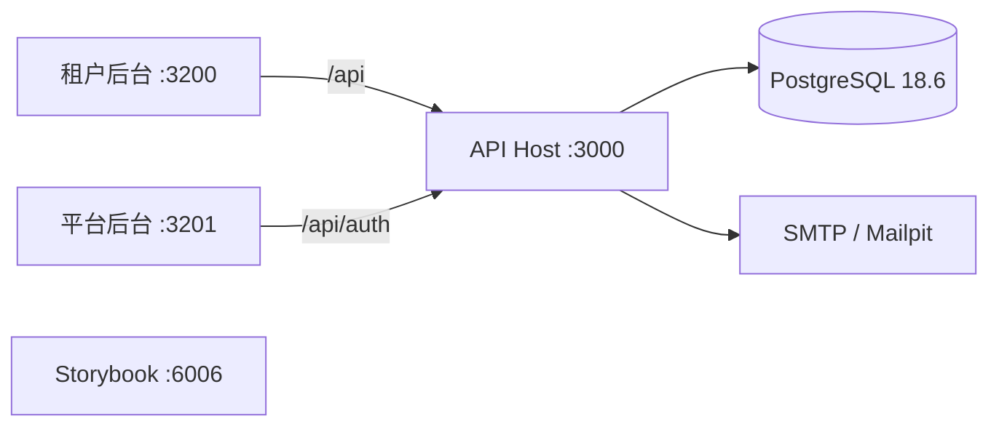

# Enterprise Admin

开源自托管的多租户企业应用基础框架。它不是后台 UI 模板，也不是以 Landing Page 为中心的 SaaS boilerplate，而是一套给二次开发用的 TypeScript 骨架：租户后台、平台后台、唯一 API Host、PostgreSQL 隔离，以及可复制的业务模块范式。

[](https://github.com/huanancaoo/enterprise-admin/actions/workflows/ci.yml)


[功能](#功能) · [仓库结构](#仓库结构) · [快速开始](#快速开始) · [环境配置](#环境配置) · [验证](#验证) · [文档](#文档)

> [!NOTE]
> 当前已交付认证与组织、租户隔离、Projects 参考领域、成员邀请、认证邮件和双后台入口。平台运营页、Worker、完整自托管发布编排尚未交付，不要按生产发行版验收。

## 功能

- **双后台、单一 API Host**：组织成员使用租户后台，平台管理员使用平台后台；授权按成员关系或平台任职执行，不按请求来自哪个 SPA 执行。
- **Better Auth Organization**：邮箱密码登录、邮箱验证、密码重置、组织创建/选择、成员邀请与角色；组织角色不能产生平台任职。
- **数据库层租户隔离**：`app_runtime` / `app_migrator` 分权，租户业务表 ENABLE/FORCE RLS，业务访问必须走 `TenantTx`。
- **Projects 参考领域**：列表、创建、详情、更新、多语言译文、删除与结构化审计，覆盖 Schema → Repository → API → OpenAPI/Orval → 页面 → E2E。
- **契约先于页面**：`packages/contracts` 定义 HTTP Schema，Nest 导出 OpenAPI，Orval 生成 TanStack Query 客户端。
- **i18n 与 RTL**：`zh-CN` / `en-US` / `ar`；界面语言由 i18next 持有，不写入后台 URL；内容语言与界面语言分离。
- **认证邮件**：SMTP + 本地 Mailpit，验证邮件、密码重置、组织邀请写入 durable outbox 后再投递。
- **工程门禁**：依赖边界、类型、i18n 漂移、单元、HTTP、Storybook/a11y、浏览器 E2E、Schema 漂移、真实 PostgreSQL 测试与生成物检查。

## 仓库结构

```text
apps/tenant          租户后台（组织成员操作面）
apps/platform        平台后台（平台管理员操作面）
apps/api             NestJS API Host 与 ea CLI
apps/storybook       公共组件工作台
apps/worker          规划位置，未启用
packages/ui          通用 UI primitives
packages/admin       业务无关后台组合层
packages/contracts   HTTP Schema
packages/api-client  生成客户端
packages/database    仅供服务端的 Schema、迁移、TenantTx
packages/permissions 固定权限声明
packages/i18n        翻译目录与运行时
packages/mocks       共享 MSW fixtures / handlers
```



业务接口在 `/api/v1`，认证在 `/api/auth`，开发文档在 `/api/docs`。打开对方后台的路由不是授权证明；`activeOrganizationId` 只是工作区偏好。

## 快速开始

需要 **Node 26.8.2**、**pnpm 12.4.1** 和可用的 **Docker**。版本以根目录 [package.json](package.json) 的 `engines` / `packageManager` 为准。

```sh
git clone https://github.com/huanancaoo/enterprise-admin.git
cd enterprise-admin
npm install --global pnpm@12.4.1
pnpm install --frozen-lockfile
```

### 1. 启动 PostgreSQL 与 Mailpit

```sh
cp infra/postgres/.env.example infra/postgres/.env
```

填写四个互不相同的密码。它们只在首次初始化空数据卷时生效。

```sh
docker compose --env-file infra/postgres/.env up -d
```

PostgreSQL 绑定 `127.0.0.1:5432`，Mailpit SMTP 为 `127.0.0.1:1025`，收件箱为 <http://127.0.0.1:8025>。

### 2. 执行迁移

```sh
cp packages/database/.env.example packages/database/.env
```

将 `MIGRATION_DATABASE_URL` 换成 `app_migrator` 与上一步的迁移密码（特殊字符必须 URL 编码），然后：

```sh
cd packages/database
node --env-file=.env src/migrate.ts
cd ../..
```

不要把这份文件注入 API。角色、授权和迁移细节见 [数据库说明](packages/database/README.md)。

### 3. 配置 API

```sh
cp apps/api/.env.example apps/api/.env
```

至少填写：

| 变量                           | 说明                                                        |
| ------------------------------ | ----------------------------------------------------------- |
| `DATABASE_URL`                 | `app_runtime` 连接串，密码与初始化文件中的 runtime 密码一致 |
| `BETTER_AUTH_SECRET`           | 至少 32 字符的随机密钥，不可暴露给前端                      |
| `GITHUB_CLIENT_ID`             | GitHub OAuth App Client ID                                  |
| `GITHUB_CLIENT_SECRET`         | GitHub OAuth App Client Secret，不可暴露给前端              |
| `EMAIL_PAYLOAD_ENCRYPTION_KEY` | 32 字节的 64 位十六进制                                     |

```sh
node -e "console.log(require('crypto').randomBytes(32).toString('hex'))"
```

`start` / `dev` / `start:debug` 由 Nest CLI 加载 `apps/api/.env`，已有进程环境变量优先。生产 `start:prod` 使用部署环境注入的变量。

### 4. 启动应用

```sh
pnpm dev
```

| 应用      | 地址                         | 单独启动                      |
| --------- | ---------------------------- | ----------------------------- |
| 租户后台  | http://localhost:3200        | `pnpm --filter tenant dev`    |
| 平台后台  | http://localhost:3201        | `pnpm --filter platform dev`  |
| API       | http://localhost:3000/api/v1 | `pnpm --filter api dev`       |
| Storybook | http://localhost:6006        | `pnpm --filter storybook dev` |

租户后台可注册、验证邮箱、创建组织，并在 `/app/projects/:organizationId` 使用 Projects。认证邮件在 Mailpit 收件箱中查看。

平台后台没有注册。创建平台管理员：

```sh
pnpm --filter api build
pnpm --filter api exec node --env-file=.env dist/console.js platform admin create \
  --email admin@example.test \
  --password 'your-password' \
  --name 平台管理员
```

该命令把邮箱标为已验证，不入队验证邮件。邮箱已被占用时失败，不会改已有用户。

> [!IMPORTANT]
> Worker 只有规划目录，未加入启动任务。未出现明确异步需求前，核心流程不依赖 Redis。

## 环境配置

配置按执行环境分开，根目录 [`.env.example`](.env.example) 只做索引，不是统一凭据文件。

| 文件                                                     | 用途                                                     |
| -------------------------------------------------------- | -------------------------------------------------------- |
| `apps/tenant/.env.example`、`apps/platform/.env.example` | 公开前端配置；复制为应用目录 `.env.local` 后由 Vite 加载 |
| `apps/api/.env.example`                                  | API 进程变量                                             |
| `infra/postgres/.env.example`                            | PostgreSQL 首次初始化，不注入 API                        |
| `packages/database/.env.example`                         | 仅迁移进程                                               |

任何 `VITE_` 变量都可能进入浏览器，只放公开配置。runtime、migrator 与 bootstrap 凭据不得共享同一份环境文件。

## 开发

命令均从仓库根目录执行。

```sh
pnpm lint
pnpm typecheck
pnpm --filter tenant dev
```

- 新增或修改 React 表单时遵循 [表单规范](docs/agents/forms.md)：TanStack Form、Zod 与 shadcn/ui `Field`。
- 向 UI 包添加 shadcn 组件时，从 `apps/tenant` 的配置入口操作，公共组件归入 `packages/ui`。
- 修改 API 契约后运行 `pnpm api:openapi`，再运行 `pnpm api:generate`，审查 OpenAPI 快照与生成客户端差异。
- 修改跨包依赖后运行 `pnpm lint:boundaries`。前端不能依赖 `database` / API server；`contracts` 不能依赖 Drizzle；公共 UI 不绑定具体业务模块。
- 格式化只针对本次修改的文件：`pnpm exec prettier --write <文件路径>`。

## 验证

浏览器测试前安装 Chromium；涉及 Testcontainers 的测试需要 Docker。

```sh
pnpm --filter storybook exec playwright install chromium
pnpm verify
```

`pnpm verify` 顺序执行 peer 检查、依赖边界与 lint、typecheck、i18n、单元、API HTTP、Storybook、浏览器 E2E、数据库 Schema 漂移、数据库测试、生产构建和 API 生成物检查。GitHub Actions 使用同一入口，并额外运行 `pnpm --filter @workspace/database test:compose`。

| 范围                 | 入口                                        |
| -------------------- | ------------------------------------------- |
| 工程边界 / API 单元  | `pnpm test:unit`                            |
| API HTTP             | `pnpm test:api`                             |
| 公共组件交互与无障碍 | `pnpm test:storybook`                       |
| 浏览器业务流程       | `pnpm test:e2e`                             |
| Schema 漂移          | `pnpm db:check`                             |
| 数据库 / 租户隔离    | `pnpm test:database`、`pnpm test:isolation` |
| 生产构建             | `pnpm build`                                |

分层、运行前提与阶段证据见 [测试说明](docs/architecture/testing.md)。构建通过不能替代业务流程验收。

## 文档

- [代理工作约定](AGENTS.md)：本地开发、包边界、验证入口
- [领域上下文](CONTEXT-MAP.md)：身份与组织、租户后台、平台后台
- [数据库说明](packages/database/README.md)：分权、迁移链、TenantTx
- [实施计划](docs/architecture/implementation-plan.md)：阶段范围与验收
- [Git 协作规范](docs/agents/git.md)

[多租户基础架构原文](docs/architecture/multi-tenant-foundation.md) 与 [Email 基础设施原文](docs/architecture/email-infrastructure.md) 是归档研究。实施决策以当前代码和已接受 ADR 为准，原文建议不自动成为任务范围。
