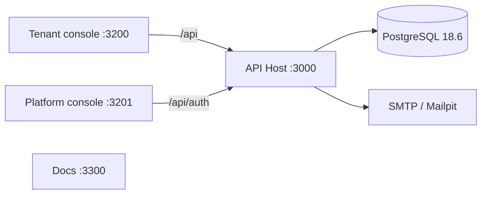

## Applications

| Path             | Role                                      |
| ---------------- | ----------------------------------------- |
| `apps/tenant`    | Organization-member console               |
| `apps/platform`  | Platform-admin console                    |
| `apps/api`       | NestJS API host and `ea` CLI              |
| `apps/docs`      | This documentation site                   |
| `apps/storybook` | Shared component workbench                |
| `apps/worker`    | Planned; not in the start graph           |

Opening the other console's route is not proof of authorization. `activeOrganizationId` is a workspace preference, not an authorization input.

## Packages

- `packages/ui`: generic UI primitives
- `packages/admin`: business-agnostic admin composition
- `packages/contracts`: HTTP schema
- `packages/api-client`: generated TanStack Query client
- `packages/database`: schema, migrations, `TenantTx` (server-only)
- `packages/permissions`: static permission declarations
- `packages/i18n`: translation catalogs and runtime

Frontend packages cannot depend on `database` or the API server. `contracts` cannot depend on Drizzle.

See [multi-tenant isolation](./multi-tenant.mdx) and [authentication](./auth.mdx).
