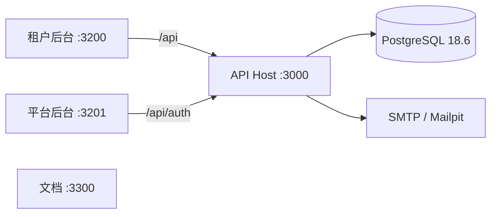

## 应用

| 路径             | 职责                         |
| ---------------- | ---------------------------- |
| `apps/tenant`    | 组织成员操作面               |
| `apps/platform`  | 平台管理员操作面             |
| `apps/api`       | NestJS API Host 与 `ea` CLI  |
| `apps/docs`      | 本开发者文档站               |
| `apps/storybook` | 公共组件工作台               |
| `apps/worker`    | 规划位置，未加入启动任务     |

打开对方后台的路由不是授权证明。`activeOrganizationId` 只是工作区偏好，不是授权输入。

## 包

- `packages/ui`：通用 UI primitives
- `packages/admin`：业务无关后台组合层
- `packages/contracts`：HTTP Schema
- `packages/api-client`：生成的 TanStack Query 客户端
- `packages/database`：Schema、迁移、`TenantTx`（仅服务端）
- `packages/permissions`：固定权限声明
- `packages/i18n`：翻译目录与运行时

前端不能依赖 `database` 或 API server。`contracts` 不能依赖 Drizzle。

见 [多租户隔离](./multi-tenant.mdx) 与 [认证](./auth.mdx)。
