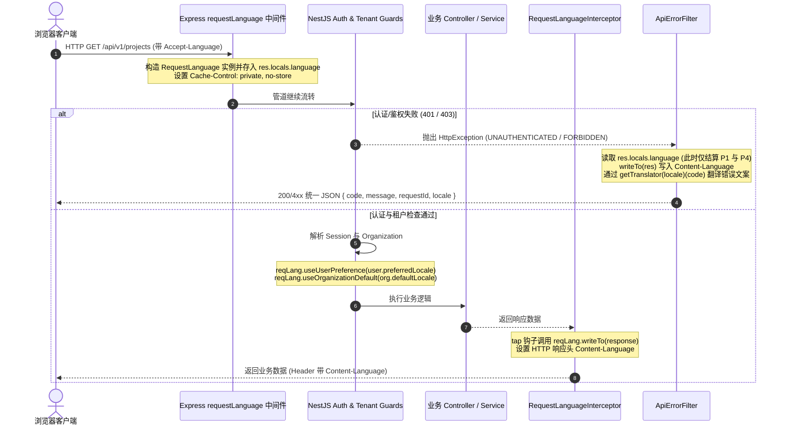
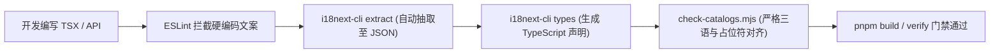

# NestJS、Better Auth 与 React 全栈 i18n 深度集成方案与架构规范

## 1. 核心挑战与架构概览

在多租户企业级应用中，国际化（i18n）不仅是前端界面文案的替换，而是一套贯穿**浏览器交互、身份认证、API 业务管道、数据持久化、事务邮件外发以及工程化质量门禁**的完整横切架构。

传统简单粗暴的国际化方案在企业级全栈 TypeScript 项目中存在四大典型反模式：

1. **纯前端国际化失效**：异步邮件（验证码、重置密码、邀请函）、SMS、后台工作流、审计日志以及供第三方集成的 OpenAPI 接口无法被客户端 `react-i18next` 翻译，导致用户体验严重撕裂。
2. **服务端全局状态污染**：在 Node.js 单进程多请求并发模型下，直接调用 `i18next.changeLanguage()` 会全局突变共享实例的语言，导致请求 A 的语言设置污染正在并发执行的请求 B。
3. **认证层与业务管道割裂**：现代认证框架（如 Better Auth）通常挂载在原生 HTTP 处理器（`/api/auth/*`）上，绕过 NestJS 的 Controller、Interceptor 和 Pipe 管道；若认证层与业务层采用不同的语言协商与错误格式，客户端将面临两套异构的错误结构与翻译机制。
4. **多租户维度偏好冲突**：企业场景下存在多重相互冲突的语言诉求——浏览器请求头（`Accept-Language`）、已登录用户的个人偏好（`user.preferredLocale`）、所在租户/组织的基线偏好（`organization.defaultLocale`）以及系统平台兜底语言。缺乏确定的协商优先级漏斗会导致文案呈现忽中忽英。

### 1.1 全栈四层架构模型

本项目基于 **React 19 + NestJS 模块化单体 + Better Auth + Drizzle/PostgreSQL + i18next** 构建了端到端全链路国际化架构：

```mermaid
flowchart TD
    subgraph Client["客户端表现层 (React / Vite)"]
        UI["React 组件 (useTranslation)"]
        Form["TanStack Form + Zod 校验"]
        RTL["DirectionProvider (html dir/lang, Base UI)"]
        Format["Intl 格式化 (数字/货币/日期)"]
    end

    subgraph Core["词条与契约中枢 (@workspace/i18n)"]
        Catalogs["三语词典 (zh-CN / en-US / ar)"]
        Namespaces["6 大命名空间 (common/auth/org/projects/validation/errors)"]
        TypeGen["i18next-cli 编译期类型生成"]
        FixedT["getFixedT 固定语言无状态 Translator"]
    end

    subgraph Auth["认证与身份层 (Better Auth)"]
        AuthI18n["@better-auth/i18n 插件 (自定义 callback 协商)"]
        AuthSchema["User.preferredLocale / Org.defaultLocale"]
        AuthErrors["认证错误拦截与多语言回写"]
        EmailHooks["事务外发邮件钩子 (绑定用户/组织语言)"]
    end

    subgraph API["业务服务端 (NestJS)"]
        LangMiddleware["RequestLanguage 中间件 (Accept-Language 解析)"]
        LangState["RequestLanguage 状态机 (注入用户/组织偏好)"]
        ErrorFilter["ApiErrorFilter (统一错误码翻译与回写)"]
        HeaderSync["Content-Language 响应标头同步"]
    end

    subgraph Outbox["离线投递 (PostgreSQL Outbox)"]
        EmailTable["email_messages 表 (持有不可变 locale)"]
        EmailWorker["Dispatcher / Worker (无头无上下文模板渲染)"]
    end

    Core -->|共享类型与词典| Client
    Core -->|提供固定 Translator| API
    Core -->|提供错误字典映射| Auth

    Client -->|HTTP 请求带 Accept-Language| Auth
    Client -->|HTTP 请求带 Accept-Language| API

    Auth -->|生产邮件 Payload (带 resolved locale)| Outbox
    Outbox -->|Worker 消费并渲染本地化 HTML| EmailWorker
    API -->|响应 Content-Language + 统一错误结构| Client
```

各分层具体职责如下：

- **词条与契约中枢 (`packages/i18n`)**：整套 Monorepo 的多语言单一事实源（SSOT）。集中管理 `zh-CN`、`en-US`、`ar` 三种语言及 6 大命名空间；通过 `i18next-cli` 自动提取代码中的翻译键并生成全局 TypeScript 模块补充声明（Declaration Merging）；导出高并发安全的服务端工厂 `getTranslator(locale)` 与客户端工厂 `createUiI18n(locale)`。
- **认证与身份层 (`packages/database/src/auth.ts`, `@better-auth/i18n`)**：利用 Better Auth 插件架构，拦截所有 `/api/auth/*` 端点的失败响应，基于 HTTP 请求头及当前 Session 用户偏好，将 `APIError` 翻译为目标语言；在用户表扩展 `preferredLocale`，组织表扩展 `defaultLocale`；在外发事务邮件时，将解析后的语言固定注入 Durable Outbox。
- **服务端业务管道层 (`apps/api` NestJS)**：以 `RequestLanguage` 状态机接管请求生命周期的语言协商；全局异常过滤器 `ApiErrorFilter` 统一拦截业务异常与 DTO 校验失败，将标准化错误码（如 `VALIDATION_ERROR`、`PROJECT_NOT_FOUND`）通过 `getTranslator` 转换为本地化消息；全局拦截器同步写入 RFC 9110 标准响应头 `Content-Language`。
- **客户端表现层 (`apps/tenant`, `apps/platform`, `packages/admin`, `packages/ui`)**：基于 React 19 和 `react-i18next` 提供 UI 局部上下文；自动双向同步 `document.documentElement.lang` 和 `dir`；无缝对接 Base UI / Radix `DirectionProvider` 实现 RTL 键盘手势与弹窗锚点自适应；将 `t` 闭包注入 TanStack Form 与 Zod 校验流。

---

## 2. 语言协商模型与生命周期状态机

### 2.1 四级优先级判定漏斗

在企业多租户系统中，语言协商不能简单取决于单一标头。系统定义了严格的 4 级优先级判定漏斗：

| 优先级         | 决策依据             | 提取源                            | 说明                                                                                                                        |
| :------------- | :------------------- | :-------------------------------- | :-------------------------------------------------------------------------------------------------------------------------- |
| **P1（最高）** | **显式请求意图**     | HTTP 请求头 `Accept-Language`     | 遵循 RFC 9110，解析权重因子 `q`（如 `zh-CN,zh;q=0.9,en;q=0.8`）。客户端当前界面切换语言后，请求优先反映用户当前的即时意图。 |
| **P2**         | **已验证用户偏好**   | `session.user.preferredLocale`    | 用户在个人设置中持久化存储的语言偏好，在 Cookie / Bearer 授权成功后激活。                                                   |
| **P3**         | **租户组织默认偏好** | `organization.defaultLocale`      | 租户层级配置的工作区通用语言。当未指明个人偏好时，遵循工作区基准。                                                          |
| **P4（保底）** | **平台全局默认语言** | `platformDefaultLocale` (`zh-CN`) | 当所有显式意图、用户偏好、组织偏好均无法匹配受支持语言白名单时的安全兜底。                                                  |

系统只接受白名单内部严格匹配的语言标签（`zh-CN`、`en-US`、`ar`），通配符 `*` 或不支持的语系（如 `fr`、`de`）将被静默忽略，平滑下落至后续优先级，严禁抛出未捕获异常。

### 2.2 NestJS 请求生命周期中的时序状态机

在标准的 NestJS 请求生命周期中：
`Middleware -> Global Guard -> Route Guard -> Interceptor (pre) -> Pipe -> Handler -> Interceptor (post) -> ExceptionFilter`

**核心矛盾**：
中间件执行最早，此时尚未执行认证守卫（AuthGuard）与租户守卫（TenantGuard），服务器无法获知当前请求归属哪位用户、哪个组织；如果过早在中间件中直接敲定语言，就无法利用 P2（用户偏好）和 P3（组织偏好）。但如果将协商完全推迟至 Handler，当路由守卫抛出 `401 Unauthorized` 或 `403 Forbidden` 时，异常过滤器就无法获得精准的本地化上下文。

**设计解法：`RequestLanguage` 渐进式状态机**

我们设计了非侵入式的 `RequestLanguage` 状态机对象，将其挂载于 Express 的 `res.locals.language`：

```typescript
// apps/api/src/http/request-language.ts
export class RequestLanguage {
  private preferredLocale?: string | null
  private defaultLocale?: string

  constructor(private readonly acceptLanguage: string | null | undefined) {}

  get locale(): SupportedLocale {
    return resolveLocale({
      acceptLanguage: this.acceptLanguage,
      preferredLocale: this.preferredLocale,
      defaultLocale: this.defaultLocale,
    })
  }

  // 认证成功后：注入已验证用户偏好 (P2)
  useUserPreference(locale: string | null | undefined): void {
    this.preferredLocale = locale
  }

  // 组织上下文解析后：注入租户默认偏好 (P3)
  useOrganizationDefault(locale: string): void {
    this.defaultLocale = locale
  }

  // 终态回写响应头
  writeTo(response: Response): SupportedLocale {
    const locale = this.locale
    response.setHeader("Content-Language", locale)
    return locale
  }
}
```

#### 请求阶段演进时序图



### 2.3 异步上下文方案评估：为什么禁止 Request-scoped Provider

在 NestJS 中传递请求级上下文通常有三种候选模式：

| 方案                                          | 机制                                                     | 内存与性能开销                                                              | 评估与结论                                                                                              |
| :-------------------------------------------- | :------------------------------------------------------- | :-------------------------------------------------------------------------- | :------------------------------------------------------------------------------------------------------ |
| **`res.locals` (状态机)**                     | 挂载于当前请求的原生 Express 响应对象                    | 零额外开销，直接引用访问                                                    | **采纳**。与 NestJS 底层 Express 引擎生命周期严格绑定，简单透明。                                       |
| **`AsyncLocalStorage` (ALS)**                 | 基于 Node.js `node:async_hooks` 维持异步调用链上下文     | 微秒级开销（约 2%~5% CPU）                                                  | **推荐（深度调用栈场景）**。若底层非 Web 领域服务（如审计、深层领域模型）需要隐式获取语言，可无感透传。 |
| **Request-scoped Provider (`Scope.REQUEST`)** | 容器对每个 HTTP 请求重新实例化该 Provider 及其全部依赖树 | **极端高开销**。依赖树整体退化为每次请求重建，GC 压力剧增，QPS 暴跌 40%~80% | **严禁使用**。违反高吞吐后端架构原则，极易引发内存泄漏与微任务队列停顿。                                |

---

## 3. Better Auth 深度国际化集成

Better Auth 是下一代现代化 TypeScript 身份认证框架。它原生将端点路由托管至 `/api/auth/*`。要实现无缝集成，必须在核心配置、Schema 扩展、错误拦截以及离线外发四个维度进行深度定制。

### 3.1 官方 `@better-auth/i18n` 机制与缺陷修复

官方 `@better-auth/i18n` 插件通过中间件劫持 Better Auth 的内部 `APIError` 抛出，并返回结构化的错误响应：

```json
{
  "code": "INVALID_EMAIL_OR_PASSWORD",
  "message": "邮箱或密码无效",
  "originalMessage": "Invalid email or password"
}
```

#### 关键缺陷：默认 Header 解析切分 bug

`@better-auth/i18n` 内置的 `"header"` 检测策略存在一个隐蔽缺陷：其默认解析器会将标准 BCP 47 语言标签（如 `zh-CN`、`en-US`）按连字符拆切，自动截断为主语言标签（如 `zh`、`en`）。这导致配置了区域字典（如 `"zh-CN"`）的工程永远无法命中匹配，直接回退到系统默认语言。

#### 修复方案：强制采用自定义回调检测 (`detection: ["callback"]`)

必须显式覆盖默认策略，通过自定义 `getLocale` 精确保留完整的语言标签，并按优先级依次匹配 HTTP 请求头与 Session 用户：

```typescript
// packages/database/src/auth-i18n.ts
const authErrorLocales = ["zh-CN", "en-US", "ar"] as const
type AuthErrorLocale = (typeof authErrorLocales)[number]

function matchAuthErrorLocale(
  value: string | null | undefined
): AuthErrorLocale | null {
  if (!value) return null
  return (
    authErrorLocales.find(
      (locale) => locale.toLowerCase() === value.toLowerCase()
    ) ?? null
  )
}

export function createAuthI18n(): BetterAuthPlugin {
  return i18n({
    translations: {
      "zh-CN": { ...locales.zh, ...customOrgErrorsZh },
      "en-US": { ...locales.en, ...customOrgErrorsEn },
      ar: { ...locales.ar, ...customOrgErrorsAr },
    },
    defaultLocale: "zh-CN",
    // 禁用插件自带的 header 策略，避免 zh-CN 被裁成 zh
    detection: ["callback"],
    getLocale: (ctx) => {
      // 1. 优先读取完整 Accept-Language 标头的主首选项
      const header = ctx.headers?.get("accept-language") ?? null
      const fromHeader = matchAuthErrorLocale(
        header?.split(",")[0]?.split(";")[0]?.trim()
      )
      if (fromHeader) return fromHeader

      // 2. 其次读取会话中已登录用户的 preferredLocale
      const preferred = ctx.context.session?.user?.preferredLocale
      return matchAuthErrorLocale(
        typeof preferred === "string" ? preferred : null
      )
    },
  })
}
```

### 3.2 错误码字典扩展与分层合并

Better Auth 核心包含近百个认证错误码（如 `USER_NOT_FOUND`、`INVALID_PASSWORD`、`SESSION_EXPIRED`）。然而，当项目启用 `organization` 等高级插件时，插件抛出的特有业务错误（例如组织停用、唯一所有者退出等）默认不在内置字典中。

必须通过解构合并（Spread Merge）实现双层错误码合并：

```typescript
const customOrgErrorsZh = {
  AUTHORIZATION_UNAVAILABLE: "授权状态不可用",
  AUTHORIZATION_VERSION_CONFLICT: "授权已变更，请刷新后重试",
  ORGANIZATION_SUSPENDED: "该组织已停用",
  ORGANIZATION_ALREADY_EXISTS: "组织已存在",
  ORGANIZATION_NOT_FOUND: "组织不存在",
  ORGANIZATION_SLUG_ALREADY_TAKEN: "该组织标识已被使用",
  USER_IS_ALREADY_A_MEMBER_OF_THIS_ORGANIZATION: "该用户已是组织成员",
  USER_IS_ALREADY_INVITED_TO_THIS_ORGANIZATION: "该用户已被邀请",
  YOU_ARE_NOT_THE_RECIPIENT_OF_THE_INVITATION: "请使用受邀邮箱账号接受邀请",
  YOU_CANNOT_LEAVE_THE_ORGANIZATION_AS_THE_ONLY_OWNER:
    "不能以唯一所有者身份退出组织",
  YOU_CANNOT_LEAVE_THE_ORGANIZATION_WITHOUT_AN_OWNER:
    "组织必须保留至少一位所有者",
  EMAIL_VERIFICATION_REQUIRED_BEFORE_ACCEPTING_OR_REJECTING_INVITATION:
    "请先验证邮箱再处理邀请",
}
```

### 3.3 数据库 Schema 扩展与偏好修改 API

在 `createAuth` 的配置中，显式声明 User 与 Organization 模型的语言偏好字段：

```typescript
// packages/database/src/auth.ts
export function createAuth(...) {
  return betterAuth({
    user: {
      additionalFields: {
        preferredLocale: {
          type: ["zh-CN", "en-US", "ar"],
          required: false,
          input: true, // 允许客户端通过 API 提交修改
        },
      },
    },
    plugins: [
      organization({
        schema: {
          organization: {
            additionalFields: {
              defaultLocale: {
                type: ["zh-CN", "en-US", "ar"],
                required: true,
                defaultValue: "zh-CN",
                input: false, // 租户默认语言仅限组织所有者在专门设置中更新
              },
            },
          },
        },
      }),
      createAuthI18n(),
    ],
  });
}
```

在前端 React 应用中，当用户切换语言且处于登录状态时，可调用 Better Auth Client 提供的标准 API 无刷新持久化并联动更新缓存：

```typescript
import { authClient } from "@workspace/admin/auth/client"

export async function changeUserLanguage(newLocale: "zh-CN" | "en-US" | "ar") {
  // 1. 同步更新 Better Auth 用户资料
  await authClient.updateUser({
    preferredLocale: newLocale,
  })
  // 2. 更新当前会话缓存
  await authClient.getSession()
}
```

### 3.4 事务外发邮件 (Outbox) 与离线消息国际化

认证邮件（注册验证、密码重置、组织邀请）是极易出现国际化漂移的重灾区。**严禁在邮件发送逻辑中依赖调用栈上的任何 HTTP 请求头**，因为：

1. 邮件发送通常由独立的后台定时器或持久化队列（Transactional Outbox / BullMQ）异步处理；
2. 在异步队列消费时，原始 HTTP 请求早已完结，上下文荡然无存；
3. 邀请邮件的接收者（Invitee）可能尚未注册系统，其界面语言未知，此时必须继承发件组织所设置的 `organization.defaultLocale`。

#### 落地规范：不可变元数据绑定

在 Better Auth 的生命周期钩子中，邮件入队前必须显式求值其静态 `locale`，并将渲染好的邮件主题、HTML、纯文本以及目标 `locale` 一同加密存入数据库 `email_messages` 表：

```typescript
// apps/api/src/email/email.service.ts
export class EmailService {
  async enqueueVerifyEmail(data: {
    user: {
      id: string
      email: string
      name: string
      preferredLocale?: string | null
    }
    url: string
  }): Promise<void> {
    // 根据用户个人偏好解析确定的邮件模板语言
    const locale = resolveEmailLocale(
      data.user.preferredLocale,
      this.config.defaultLocale
    )

    await this.enqueue({
      organizationId: null,
      templateKey: "verify-email",
      locale,
      to: data.user.email,
      idempotencyKey: `auth.verify-email/${data.user.id}/${hashEmailUrl(data.url)}`,
      rendered: renderVerifyEmail(locale, {
        name: data.user.name,
        verifyUrl: data.url,
      }),
      replaceOnConflict: true,
    })
  }

  async enqueueInvitation(data: {
    email: string
    organization: { id: string; name: string; defaultLocale?: string | null }
    invitation: { id: string }
    inviter: { user: { name: string } }
  }): Promise<void> {
    // 邀请函使用组织的默认语言，确保企业对外面貌一致
    const locale = resolveEmailLocale(
      data.organization.defaultLocale,
      this.config.defaultLocale
    )

    await this.enqueue({
      organizationId: data.organization.id,
      templateKey: "organization.invitation",
      locale,
      to: data.email,
      idempotencyKey: `organization/${data.organization.id}/invitation/${data.invitation.id}/send`,
      rendered: renderInvitationEmail(locale, {
        inviterName: data.inviter.user.name,
        organizationName: data.organization.name,
        acceptUrl: acceptUrl.href,
      }),
      replaceOnConflict: false,
    })
  }
}
```

后台 Dispatcher 消费消息时，直接读取该行记录已加密的静态渲染产物，无需任何运行时动态翻译解析，实现真正的无状态投递与审计可追溯性。

---

## 4. NestJS 服务端国际化落地方案

### 4.1 选型评估：自建共享模块 vs `nestjs-i18n`

在社区中，`nestjs-i18n` 是一个常见选择。然而在严格的 Monorepo 工程（Turborepo + pnpm workspace）中，深度评估表明自建轻量共享包（基于 `i18next` 官方内核）具有压倒性优势：

| 评估维度           | 社区生态 `nestjs-i18n`                      | 本项目自建 `@workspace/i18n` + `getFixedT`                                       |
| :----------------- | :------------------------------------------ | :------------------------------------------------------------------------------- |
| **词典与类型复用** | 独立维护后端 YAML/JSON 目录，与前端词典割裂 | **100% 共享**。前端与后端引用同一个 `@workspace/i18n` 包                         |
| **构建与打包体积** | 引入文件加载器、各类解析器及复杂反射元数据  | **零冗余**。仅依赖轻量级 `i18next` 纯运行时，无额外副作用                        |
| **编译期强类型**   | 依赖其特定的 AST 命令行工具生成类型         | 使用统一的 `i18next-cli types`，前后端完全一致的代码提示                         |
| **并发安全性**     | 依赖其内部的异步上下文或装饰器提取          | **数学级不可变**。通过 `instance.getFixedT(locale, ns)` 生成闭包函数，零状态争用 |

### 4.2 服务端并发安全：`getFixedT` 纯函数范式

Node.js 事件循环是单线程共享内存的。**严禁在服务端请求处理中执行 `i18n.changeLanguage(locale)`**。

正确做法是在应用启动时初始化一个单例 `i18n` 实例，在请求拦截或过滤阶段，通过 `instance.getFixedT(locale, namespace)` 派生出一个绑定了固定语言的纯函数翻译器（Translator）：

```typescript
// packages/i18n/src/index.ts
const instance = createInstance()
void instance.init({
  initAsync: false,
  lng: platformDefaultLocale,
  fallbackLng: false, // 严格禁止隐式兜底，迫使所有支持语言完整翻译
  resources,
  defaultNS: "errors",
  interpolation: { escapeValue: false },
})

export function getTranslator(locale: SupportedLocale) {
  // getFixedT 返回一个只读闭包，不会修改 instance 本身的状态
  return instance.getFixedT(locale, "errors")
}
```

### 4.3 统一异常过滤器 (`ApiErrorFilter`) 与标准响应格式

所有业务 API 路由均挂载在 `/api/v1`。当控制器或领域服务抛出异常时，全局异常过滤器 `ApiErrorFilter` 统一负责错误塑形与翻译：

```typescript
// apps/api/src/http/api-error.filter.ts
@Catch()
export class ApiErrorFilter implements ExceptionFilter {
  private readonly logger = new Logger(ApiErrorFilter.name)

  catch(error: unknown, host: ArgumentsHost): void {
    const response = host.switchToHttp().getResponse<Response>()
    const status = error instanceof HttpException ? error.getStatus() : 500

    const defaultStatusCodes: Record<number, ApiErrorCode> = {
      400: "VALIDATION_ERROR",
      401: "UNAUTHENTICATED",
      403: "FORBIDDEN",
      404: "NOT_FOUND",
    }

    // 优先读取业务显式抛出的标准 ApiErrorCode，否则按 HTTP Status 映射
    const code =
      declaredCode(error) ?? defaultStatusCodes[status] ?? "INTERNAL_ERROR"

    // 从当前请求状态机获取协商后的最终语言，并写入 Content-Language 标头
    const locale = getRequestLanguage(response).writeTo(response)
    const requestId = response.locals.requestId as string

    if (status >= 500) {
      this.logger.error({ event: "api.request.failed", requestId, error })
    }

    // 严密对齐 @workspace/contracts 定义的 ApiError 契约
    const body: ApiError = {
      code,
      message: getTranslator(locale)(code), // 纯函数无副作用翻译
      requestId,
      locale,
    }

    response.status(status).json(body)
  }
}
```

响应体始终保持确定性结构：

```json
{
  "code": "ORGANIZATION_SUSPENDED",
  "message": "该组织已停用",
  "requestId": "4c9d7496-e17f-4ca6-bbf5-037c35f9bb27",
  "locale": "zh-CN"
}
```

---

## 5. React 前端国际化与多语言工程范式

### 5.1 运行时实例与路由解耦原则

在 `apps/tenant` 和 `apps/platform` 中，每个 SPA 在挂载阶段创建属于自己的 UI i18n 实例，并包裹在 `UiI18nProvider` 中：

```tsx
// apps/tenant/src/main.tsx
const i18n = createUiI18n()

createRoot(document.getElementById("root")!).render(
  <StrictMode>
    <UiI18nProvider instance={i18n}>
      <App />
    </UiI18nProvider>
  </StrictMode>
)
```

> [!IMPORTANT]
> **架构约束：语言状态不进入 URL Path**
> 面向企业管理的 Admin SPA 与公共面向 C 端的 SEO 官网不同。后台应用的路由如 `/app/projects/:id` 表达的是**资源唯一标识**。将语言置于路径中（如 `/zh-CN/app/projects/:id`）会导致用户切换语言时发生硬重定向、破坏表单未提交状态、并在分享链接时强行覆盖他人的语言偏好。因此，UI Locale 的唯一事实源是 i18next 运行时状态，持久化以用户资料（DB）和 LocalStorage 为准，不进入路由。

### 5.2 RTL (从右向左) 体系与无障碍 (A11y) 深度适配

系统原生支持阿拉伯语（`ar`）。RTL 不仅仅是文本对齐，它涵盖了整个文档渲染树、CSS 盒模型流向以及键盘导航语义的翻转。

#### 1. DOM 属性全局同步

`syncDocumentLanguage` 监听 i18next 的 `languageChanged` 事件，原子更新根节点属性：

```typescript
// packages/i18n/src/config.ts
export const localeMeta = {
  "zh-CN": { label: "简体中文", direction: "ltr" },
  "en-US": { label: "English", direction: "ltr" },
  ar: { label: "العربية", direction: "rtl" },
} as const

export function syncDocumentLanguage(instance: i18n, document: Document) {
  const sync = () => {
    const locale = instance.language as SupportedLocale
    document.documentElement.lang = locale
    document.documentElement.dir = localeMeta[locale].direction
  }
  sync()
  instance.on("languageChanged", sync)
  return () => instance.off("languageChanged", sync)
}
```

#### 2. Base UI / Radix DirectionProvider 级联

所有弹出层（Dialog、Popover、DropdownMenu）和滑块（Slider）、键盘左右导航均依赖统一的 `DirectionContext`。我们在后台公共布局中挂载 `AdminDirectionProvider`：

```tsx
<DirectionProvider dir={direction}>
  <TooltipProvider>{children}</TooltipProvider>
</DirectionProvider>
```

在 RTL 模式下，用户按下 `ArrowRight` 会被正确解释为“向前/收起”，按下 `ArrowLeft` 解释为“向后/展开”，彻底符合 W3C 无障碍标准。

#### 3. CSS 逻辑属性（CSS Logical Properties）硬性约束

**严禁使用任何物理方向属性**。ESLint 与 Code Review 严格拦截以下写法：

| 严禁的物理属性             | 强制使用的逻辑属性 / Tailwind 类名 | 语义解释                     |
| :------------------------- | :--------------------------------- | :--------------------------- |
| `margin-left` / `ml-4`     | `margin-inline-start` / `ms-4`     | 文本行内起始方向外边距       |
| `margin-right` / `mr-4`    | `margin-inline-end` / `me-4`       | 文本行内结束方向外边距       |
| `padding-left` / `pl-2`    | `padding-inline-start` / `ps-2`    | 文本行内起始方向内边距       |
| `padding-right` / `pr-2`   | `padding-inline-end` / `pe-2`      | 文本行内结束方向内边距       |
| `left-0`                   | `start-0`                          | 绝对定位起始边               |
| `right-0`                  | `end-0`                            | 绝对定位结束边               |
| `text-left` / `text-right` | `text-start` / `text-end`          | 文本对齐依据书写方向自动适配 |

### 5.3 响应与表单集成 (TanStack Form + Zod)

遵循本项目 [表单规范](../agents/forms.md)，表单使用 TanStack Form 管理状态，Zod 构建验证 Schema。

为保证校验文案动态随当前语言切换，严禁在模块根作用域定义静态包含硬编码或单次求值翻译的 Zod Schema。必须采用**工厂函数注入 `t` 闭包**：

```typescript
// packages/admin/src/auth/auth-pages.tsx
function resetPasswordSchema(t: TFunction<["auth", "validation"]>) {
  return z
    .object({
      password: z
        .string()
        .min(1, t("validation:passwordRequired"))
        .min(8, t("validation:passwordMin"))
        .max(128, t("validation:passwordMax")),
      confirmPassword: z.string().min(1, t("validation:passwordRequired")),
    })
    .refine((data) => data.password === data.confirmPassword, {
      message: t("validation:passwordMismatch"),
      path: ["confirmPassword"],
    })
}
```

在组件内部通过 `useTranslation` 实例化，当用户触发语言改变时，Hook 驱动组件重绘并重新生成具有最新词典的校验 Schema。

### 5.4 复杂数据格式化体系 (ECMAScript `Intl`)

> [!CAUTION]
> **致命陷阱：严禁从语言（Locale）隐式推导货币或时区！**
>
> 1. 用户选择阿拉伯语（`ar`），其所在企业结算货币可能是美元（`USD`），强行推导会导致金额货币符号错误。
> 2. 用户选择英语（`en-US`），但人在东京工作，强行按语言将时间显示为美国时区会导致业务排程严重失误。

我们通过 `createFormatter(locale)` 封装标准 ECMA-402 API，并在 API 签名中通过强类型要求**必须显式提供货币和时区**：

```typescript
// packages/i18n/src/format.ts
export function createFormatter(locale: SupportedLocale) {
  return {
    // 强制显式提供 currency 参数
    currency(amount: number, options: { currency: string }): string {
      return new Intl.NumberFormat(locale, {
        style: "currency",
        currency: options.currency,
      }).format(amount)
    },
    // 强制显式提供 timeZone 参数
    dateTime(date: Date | number, options: { timeZone: string }): string {
      return new Intl.DateTimeFormat(locale, {
        timeZone: options.timeZone,
        year: "numeric",
        month: "short",
        day: "numeric",
        hour: "2-digit",
        minute: "2-digit",
      }).format(date)
    },
    relativeTime(value: number, unit: Intl.RelativeTimeFormatUnit): string {
      return new Intl.RelativeTimeFormat(locale, { numeric: "auto" }).format(
        value,
        unit
      )
    },
  }
}
```

---

## 6. 工具链与工程化质量门禁

为了确保多语言架构在多人协作及长期迭代中不发生腐化，本项目建立了一套自动化工具链与 CI 门禁体系。



### 6.1 `i18next-cli` 工具流与类型补全

在 `packages/i18n` 中配置 `i18next.config.ts`，定义命名空间、提取路径与生成目标：

```typescript
// packages/i18n/i18next.config.ts
export default {
  locales: ["zh-CN", "en-US", "ar"],
  defaultLocale: "zh-CN",
  namespaces: [
    "common",
    "auth",
    "organization",
    "projects",
    "validation",
    "errors",
  ],
  input: ["../../apps/**/*.{ts,tsx}", "../../packages/**/*.{ts,tsx}"],
  output: "./src/locales/$LOCALE/$NAMESPACE.json",
  types: {
    output: "./src/generated/i18next.ts",
  },
}
```

运行编译后，自动生成全局类型声明：

```typescript
// packages/i18n/src/generated/i18next.ts
import "i18next"
import type resources from "./resources.js"

declare module "i18next" {
  interface CustomTypeOptions {
    defaultNS: "common"
    resources: (typeof resources)["zh-CN"]
  }
}
```

这使得在全仓任何位置调用 `t("auth:signIn")` 时，IDE 均能提供自动补全；若键名拼写错误或缺少插值参数，TypeScript 编译器将直接报错阻断构建。

### 6.2 零容忍 CI 门禁检查 (`i18n:check`)

在 CI 流水线中，`pnpm i18n:check` 被纳入必经的 `pnpm verify` 环节，依次执行以下 5 项测试：

```sh
pnpm --filter @workspace/i18n exec i18next-cli lint
pnpm --filter @workspace/i18n exec i18next-cli extract --ci --dry-run
pnpm --filter @workspace/i18n exec i18next-cli types --ci
pnpm --filter @workspace/i18n exec i18next-cli status
node packages/i18n/scripts/check-catalogs.mjs
```

1. **`i18next-cli lint`**：利用 AST 静态扫描所有 React 组件，检测是否存在未包裹在 `t()` 中的裸硬编码中文字符串或英文短语。
2. **`extract --ci --dry-run`**：检查当前源码中的翻译调用是否已完全提取至 JSON 词典。若有新增文案未入库，CI 立即报错失败，严禁代码与词典发生漂移。
3. **`types --ci`**：确保生成的 TypeScript 类型定义文件与 JSON 词典严格一致，杜绝未经重新编译的陈旧类型。
4. **`status`**：检查所有引用到的翻译键是否在主语言（`zh-CN`）中均有对应定义。
5. **`check-catalogs.mjs` (深度一致性校验)**：执行全维度矩阵检查：
   - **命名空间集合对齐**：确保所有语言目录下的 `.json` 文件集合完全一致；
   - **键集合对齐**：确保 `en-US` 和 `ar` 的键集合与 `zh-CN` 100% 镜像一致，零多余键、零遗漏键；
   - **非空值校验**：任何语言下的任何词条值不得为空字符串或纯空白；
   - **插值变量一致性**：自动提取形如 `{{name}}`、`{{count}}` 的占位符，断言所有语种翻译中的变量占位符完全匹配，防止运行时插值遗漏导致渲染 `undefined`。

---

## 7. 架构决策对比总结

| 关注维度              | 朴素集成方案（反模式）                           | 本方案生产落地标准                                              |
| :-------------------- | :----------------------------------------------- | :-------------------------------------------------------------- |
| **共享事实源**        | 各端各自维护一套 JSON 文件，容易版本脱节         | 统一维护在 `@workspace/i18n`，CLI 统一提取与类型生成            |
| **类型安全保障**      | 纯字符串入参 `t('some.key')`，靠人工对账         | 强类型补丁生成，编译期校验键名有效性及插值变量                  |
| **并发隔离机制**      | 服务端调用 `changeLanguage()` 产生并发竞争       | 服务端通过 `getFixedT(locale)` 导出无状态纯函数闭包             |
| **协商状态机**        | 中间件单点决定，忽略后续鉴权产生的身份与租户偏好 | `RequestLanguage` 渐进式累积状态，随生命周期管道逐步丰富        |
| **Better Auth 集成**  | 依赖插件默认 header 拆分导致 `zh-CN` 被截断      | 自定义 `callback` 严格匹配三语白名单，双层错误码合并            |
| **异步离线邮件**      | 异步 Worker 试图读取不存在的 HTTP 上下文         | 入队阶段直接将确定的 `locale` 和静态渲染结果存入 Outbox 表      |
| **阿拉伯语 RTL 支持** | 简单设置 `dir="rtl"`，界面弹窗和键盘错位         | `html.dir` + Base UI `DirectionProvider` + CSS 逻辑属性深度闭环 |
| **格式化解耦**        | 从用户当前语言直接猜测所属国家、货币和时区       | `createFormatter` 强制调用方显式传递 `currency` 与 `timeZone`   |
| **CI 门禁与质量**     | 仅做单元测试，上线后频现白屏与键名缺失           | 自动提取核对、词典键全对齐、空值检测、占位符全量验证五道关卡    |

---

## 8. 一级权威来源与文献引用

本文档中涉及的设计原则、协议机制与 API 用法均直接源自以下一级权威规范与官方技术文档：

1. **Better Auth 官方规范**
   - Better Auth i18n Plugin Specification: [https://better-auth.com/docs/plugins/i18n](https://better-auth.com/docs/plugins/i18n)
   - Better Auth Error Handling & Codes Reference: [https://better-auth.com/docs/reference/errors](https://better-auth.com/docs/reference/errors)
   - Better Auth Plugins Architecture: [https://better-auth.com/docs/plugins](https://better-auth.com/docs/plugins)
2. **NestJS 官方文档**
   - NestJS Exception Filters & Error Handling: [https://docs.nestjs.com/exception-filters](https://docs.nestjs.com/exception-filters)
   - NestJS Interceptors & Response Transformation: [https://docs.nestjs.com/interceptors](https://docs.nestjs.com/interceptors)
   - NestJS Injection Scopes & Performance Hazards (`Scope.REQUEST`): [https://docs.nestjs.com/fundamentals/injection-scopes](https://docs.nestjs.com/fundamentals/injection-scopes)
3. **i18next 与 react-i18next 官方规范**
   - i18next Instance API & Fixed-T Translator: [https://www.i18next.com/overview/api#getfixedt](https://www.i18next.com/overview/api#getfixedt)
   - i18next TypeScript Integration & Declaration Merging: [https://www.i18next.com/overview/typescript](https://www.i18next.com/overview/typescript)
   - i18next-cli Tooling: [https://github.com/i18next/i18next-cli](https://github.com/i18next/i18next-cli)
4. **W3C 国际化工作组标准 (W3C i18n Working Group)**
   - Structural markup and right-to-left text in HTML: [https://www.w3.org/International/questions/qa-html-dir](https://www.w3.org/International/questions/qa-html-dir)
   - CSS Logical Properties and Values Spec (Level 1): [https://www.w3.org/TR/css-logical-1/](https://www.w3.org/TR/css-logical-1/)
5. **IETF RFC 协议规范**
   - RFC 9110: HTTP Semantics, Section 12.5.3 `Accept-Language` & `Content-Language`: [https://www.rfc-editor.org/rfc/rfc9110.html#section-12.5.3](https://www.rfc-editor.org/rfc/rfc9110.html#section-12.5.3)
   - RFC 5646: Tags for Identifying Languages (BCP 47): [https://www.rfc-editor.org/rfc/rfc5646.html](https://www.rfc-editor.org/rfc/rfc5646.html)
6. **ECMAScript 国际化 API 规范**
   - ECMA-402: ECMAScript Internationalization API Specification (`Intl` object): [https://tc39.es/ecma402/](https://tc39.es/ecma402/)
