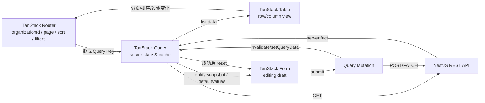
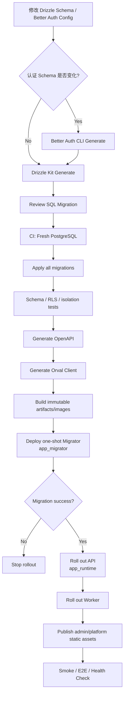

# 开源自托管多租户企业应用基础框架：合并修订技术架构

## 执行摘要与优先实施建议

我将本项目定位为一套 **Open-source Multi-Tenant Enterprise Application Foundation**：它不是单纯的后台 UI 模板，也不是以 Landing Page、Stripe 和 SEO 为中心的 SaaS Boilerplate，而是一套面向企业二次开发的、前后端边界明确、可自托管、强多租户隔离、具备统一 API 契约和完整工程化能力的 TypeScript 应用基础框架。此前的架构决策已经确定 React + Vite、NestJS 模块化单体、Better Auth Organization、Drizzle/PostgreSQL、REST/OpenAPI、Turborepo、Storybook，以及平台端与租户端的边界；国际化修订又补充了 i18next、`Intl`、RTL、语言协商和租户多语言内容模型。本文件将两份决策合并为当前统一架构基线。fileciteturn0file0 fileciteturn0file1

本项目**继续坚持 React + Vite，而不切换 Next.js**。Vite 的生产构建本身适合输出静态托管应用，而业务 API、认证、数据库访问和后台任务全部由独立 NestJS 后端承担，因此没有必要再引入第二套服务端 React Runtime。citeturn13search12turn13search13

截至本次修订，最高优先级的实施建议如下：

| 优先级 | 决策 | 原因 |
|---|---|---|
| **P0** | 先完成 `TenantContext + runInTenant() + PostgreSQL RLS + app_runtime/app_migrator` | 多租户隔离是整个项目最重要、最难后补的安全基础；PostgreSQL RLS 对普通运行角色有效，但超级用户、`BYPASSRLS` 和通常情况下的表所有者可绕过，因此账号模型必须从第一版建立。citeturn16search7turn17search12 |
| **P0** | 用 `Projects` 做完整 Reference Domain | 必须验证 Schema → RLS → Repository → API → OpenAPI → Orval → Router/Query/Table/Form → Storybook → E2E 全链路，否则框架容易只剩抽象而缺乏可复制范式。此做法也与成熟 starter 提供参考资源模块的实践一致。citeturn22search0 |
| **P1** | 立即建立 `packages/ui` 与 `packages/admin` 的双层组件体系 | shadcn/ui 解决 primitive，不解决 Resource List、Filter、Bulk Action、Permission Gate 等 Admin Domain Components；shadcn-admin-kit 已证明这层抽象对后台 DX 很重要。citeturn21search1 |
| **P1** | API 契约先稳定，再大量开发页面 | NestJS 生成 OpenAPI，Orval 从规范生成 TanStack Query 客户端，使 Web、未来移动端或其他客户端依赖稳定 HTTP 契约而非后端内部类型。citeturn16search0turn16search5 |
| **P1** | i18n 和 RTL 从 UI 基建阶段进入，而不是产品完成后补 | W3C 建议页面级 RTL 使用 `<html dir="rtl">`，布局则优先 logical properties；这会直接影响所有公共组件的定位、间距和图标设计。citeturn10search0turn12search12 |

**最终架构总览：**

| 层级 | 最终方案 | 推荐版本范围/策略 | 核心职责 |
|---|---|---|---|
| Runtime | Node.js | **24 LTS 推荐** | API、Worker、构建、CLI 统一运行时 |
| 语言 | TypeScript | 无特定约束；Strict | 全仓库类型基础 |
| Monorepo | pnpm + Turborepo | 无特定约束；锁 lockfile | Workspace、任务图、缓存 |
| 前端 | React + Vite | 无特定约束；稳定 major | 两套 SPA：Tenant Admin / Platform |
| 路由 | TanStack Router | v1 稳定线 | URL、Path、Search Params |
| Server State | TanStack Query | 当前稳定版 | 请求、缓存、Mutation、失效 |
| 表格 | TanStack Table | 当前稳定版 | 行列模型及表格视图状态 |
| 表单 | TanStack Form | **v1 稳定线** | Draft、Field State、Validation |
| Schema | Zod | **4.x 推荐** | Router Search、Form、API 输入边界 |
| UI | shadcn/ui + Tailwind CSS | 无特定约束 | 可拥有源码的基础组件体系 |
| 组件工作台 | Storybook React/Vite | 当前稳定版；Vite ≥5 | 组件隔离开发与测试；官方 React/Vite 集成要求 Vite ≥5。citeturn18search1 |
| Mock | MSW | **≥2** | 浏览器、Storybook、测试共用网络 Mock；Storybook Vitest 集成要求 MSW 使用时 ≥2。citeturn18search5turn18search6 |
| 前端测试 | Vitest | **≥3** | 单元、组件与 Story 测试。citeturn18search5 |
| 后端 | NestJS + Express | NestJS 11.x 基线 | REST API、模块化单体、Guard/Service |
| 认证 | Better Auth + Organization | 当前稳定 1.x，锁 minor | Session、User、Organization、Member、Invite、组织角色 |
| ORM | Drizzle ORM | 无特定约束；锁验证版本 | 类型安全 SQL 与 Schema |
| DB Driver | `pg` | 无特定约束 | PostgreSQL Pool |
| Migration | Drizzle Kit | 与 Drizzle 同版本线 | 生成、审查、执行 SQL Migration |
| 数据库 | PostgreSQL | **18 推荐；17 可作为兼容目标** | 业务、认证、审计、RLS |
| API | REST + OpenAPI + Orval | 无特定约束 | 跨客户端稳定契约 |
| i18n | i18next + react-i18next | i18next **≥26.3.4**，锁 26.x | UI/Node 翻译 Runtime |
| i18n Tooling | i18next-cli | 当前稳定版；Node ≥22 | 提取、类型、Lint、翻译状态检查。citeturn19search0 |
| Locale Formatting | 原生 `Intl` | Runtime 内置 | 日期、数字、货币、相对时间；ECMA-402 将 locale、time zone、numbering system 等作为独立配置。citeturn20search0 |
| Queue | BullMQ + Redis | **按需启用** | 导入导出、邮件重试、Webhook、耗时任务 |
| Observability | Pino + OpenTelemetry | 无特定约束 | 结构化日志、Trace、Metric；OTel JS 可用于 NestJS/Node。citeturn10search1 |
| 部署 | Docker Compose | 默认 | 自托管基线 |
| 编排 | Kubernetes | 可选 | 大规模、多实例部署，不作为使用前提 |
| License | Apache-2.0 | 推荐 | 企业友好开源基线；ASF 建议项目携带 LICENSE，并视情况维护 NOTICE。citeturn20search1 |

**下一步任务清单：** ☐ 将本文件作为 Architecture Baseline ADR； ☐ 固定 Node 24 LTS 与 package manager 版本； ☐ 创建最小 Monorepo 骨架； ☐ 优先建立 PostgreSQL 账号/RLS PoC； ☐ 创建 `Projects` Reference Domain 的验收清单。

## 总体架构与职责边界

整个系统采用**前后端分离的模块化单体**。前端由两个 React + Vite SPA 构成：`apps/tenant` 服务租户用户，`apps/platform` 服务平台运营人员；后端保持单一 NestJS API Host，按 Identity、Tenancy、Authorization、Platform、Audit、Files、Notifications、Localization 及业务模块划分。Better Auth Organization 提供 Organization、Member、Invitation 及组织级 Access Control，不再自行实现第二套重复成员系统。citeturn14search2

Better Auth 的 NestJS 集成目前由社区维护，而且官方集成文档仍将 Fastify 支持标为 beta，因此首版 NestJS Adapter 选择 Express，减少认证集成变量。citeturn14search0

前端状态管理必须遵守**单一所有者原则**。TanStack Router 的 Search Params 是类型化、可验证、可分享和可恢复的 URL 状态，因此分页、已应用筛选、排序等应由 Router 持有；TanStack Query 只保存服务端事实；TanStack Table 只持有当前表格视图；TanStack Form 只持有尚未提交的编辑草稿。citeturn13search0turn13search4

| 层/工具 | 唯一职责 | 不应该负责 |
|---|---|---|
| **TanStack Router** | Path、`organizationId`、分页、排序、已应用 Filter、可分享页面状态 | Server Cache、Form Draft、Table Rows |
| **TanStack Query** | Server State、Cache、Mutation、Background Refresh、Invalidation | URL、未提交 Form State |
| **TanStack Table** | Column、Row Selection、Expand、Column Visibility、本地视图状态 | 服务端缓存、第二份 Pagination/Filter Source |
| **TanStack Form** | Values、Dirty、Touched、Errors、Field Dependencies、未提交 Draft | Query Cache、URL |
| **i18next** | 当前 UI Locale 与 Message Resolution | Tenant、Authorization、URL Routing |
| **React Local State** | Dialog、Popover、临时 Hover/Toggle | 长生命周期业务状态 |
| **NestJS** | HTTP、业务规则、AuthZ、Tenant Context、事务入口 | 浏览器 View State |
| **Better Auth** | Identity、Session、Organization Membership | 业务数据范围 Policy |
| **PostgreSQL RLS** | 数据库层 Tenant Safety Net | 用户业务权限模型本身 |

表格分页的推荐数据流不是 Table 自己维护一份 `pageIndex`，而是 Table 的交互更新 Router Search；Router Search 构造 Query Key；Query 取得服务端结果后交给 Table 渲染。TanStack Table 本身支持 manual/server-side sorting/filtering，因此没有必要保留第二份服务端列表状态。citeturn13search0turn0search4



这张图的核心规则是：**Query Cache 表示已经提交的服务端事实；Form 表示用户尚未提交的草稿。** 不允许在用户输入时直接修改 Query Cache，也不允许在 Form 内保存列表页 Router 状态。Router 的类型安全 Path/Search Params 能够保证 `organizationId`、分页和筛选边界在编译期和运行时都有明确结构。citeturn13search0turn13search1

业务 Query Key 统一使用工厂，不允许各页面自由拼字符串，例如：

```ts
export const projectKeys = {
  all: (organizationId: string) =>
    ["organizations", organizationId, "projects"] as const,

  list: (
    organizationId: string,
    params: ProjectListQuery,
    representation?: {
      userScope?: string;
      locale?: string;
    },
  ) =>
    [
      ...projectKeys.all(organizationId),
      "list",
      params,
      representation,
    ] as const,

  detail: (
    organizationId: string,
    projectId: string,
  ) =>
    [
      ...projectKeys.all(organizationId),
      "detail",
      projectId,
    ] as const,
};
```

只有当响应确实依赖当前用户权限范围时才把用户/权限范围放入 Key；只有服务端 Representation 会随 locale 变化时才把 locale 放入 Key。纯机器字段如 `{status:"ACTIVE"}` 不应因为 UI 语言改变而生成重复 Cache。Orval 可以从 OpenAPI 生成类型化 TanStack Query hooks 和 Query Key，本项目在其上增加统一 Query Key Policy。citeturn16search5

路由基线建议：

```text
/login
/app/select-organization

/app/:organizationId/
├── dashboard
├── projects
├── projects/:projectId
├── members
├── roles
├── files
├── audit
└── settings

/platform/
├── organizations
├── users
├── audit
└── settings
```

`apps/tenant` 与 `apps/platform` 物理拆分，但共同消费 `packages/ui` 和 `packages/admin`。这是借鉴成熟企业 starter 将 Operator Console 与 Tenant Application 分开的实践；FullStackHero 当前同样维护独立 operator admin 与 tenant dashboard React/Vite 客户端。citeturn22search1

**下一步任务清单：** ☐ 定义 Route Search Schema 规范； ☐ 创建 Query Key Factory 规范； ☐ 制定 Form→Mutation→Invalidate→Reset 模板； ☐ 建立 `apps/tenant` 与 `apps/platform` Composition Root； ☐ 禁止 `packages/ui`、`packages/admin` 直接依赖 Database/API Server 包。

## 前端组件、Storybook 与国际化体系

前端组件采用两层结构。`packages/ui` 保存可跨应用复用的 Design-System/Primitive；`packages/admin` 保存带后台领域语义但仍不绑定具体业务实体的 Admin Domain Components。shadcn-admin 展示了 React + Vite + TanStack Router + shadcn/ui 的成熟后台 Shell，并针对 Dialog、Table、Sidebar、Select 等组件专门维护 RTL 兼容；shadcn-admin-kit 则进一步证明 List/Create/Edit/Show、DataTable、Filter、Bulk Actions、Reference、Access Control 等“后台领域组件”值得被抽象。citeturn21search0turn21search1

推荐组件边界：

| 层级 | 组件 |
|---|---|
| `packages/ui` | `Button`、`Input`、`Textarea`、`Select`、`Combobox`、`Checkbox`、`RadioGroup`、`Dialog`、`Sheet`、`Popover`、`Tooltip`、`Tabs`、`DropdownMenu`、`Command`、`Badge`、`Skeleton`、`Toast`、`DatePicker`、基础 `Table` |
| `packages/admin` | `AppShell`、`PageHeader`、`Breadcrumbs`、`TenantSwitcher`、`LocaleSwitcher`、`PermissionGate`、`ResourceList`、`ResourceShow`、`ResourceCreate`、`ResourceEdit`、`DataTable`、`FilterBar`、`ColumnSelector`、`BulkActions`、`Pagination`、`EntityForm`、`FormDialog`、`FormSheet`、`DetailPanel`、`AuditTimeline`、`EmptyState`、`ErrorState`、`LoadingState`、`ConfirmDangerAction` |
| `apps/tenant` | Projects、Members、Roles、Files、Settings 等真实 Tenant Feature |
| `apps/platform` | Organization Operations、Platform Users、Cross-Tenant Audit 等平台专属 Feature |

这里不引入 `ra-core`、React-admin 或 Refine 作为运行时基础。我们的目标是借鉴 Resource/Admin Domain Component 思想，同时继续保持 TanStack Router、Query、Table、Form 的状态模型，不重新引入 React Router 或 React Hook Form。shadcn-admin-kit 当前技术栈正是 React Router + TanStack Query + React Hook Form + Ra-Core，因此更适合作为设计参考，而非直接核心依赖。citeturn21search1

Storybook 独立部署在 `apps/storybook`，消费 `packages/ui` 和 `packages/admin`。官方 React/Vite 集成能够隔离运行组件；Storybook 的 Vitest addon 要求 Vite-based Storybook、Vitest ≥3，并在使用 MSW 时要求 MSW ≥2；Accessibility addon 可将 axe-core 检查纳入 Story 测试。citeturn18search1turn18search5turn18search12

`packages/mocks` 成为统一 Mock Source：

```text
packages/mocks/
├── src/
│   ├── fixtures/
│   │   ├── organizations.ts
│   │   ├── members.ts
│   │   └── projects.ts
│   ├── handlers/
│   │   ├── auth.ts
│   │   ├── projects.ts
│   │   └── platform.ts
│   ├── scenarios/
│   │   ├── permission-denied.ts
│   │   ├── slow-network.ts
│   │   └── server-error.ts
│   └── index.ts
```

MSW 的 handler 可以在浏览器、集成测试和 Storybook 之间复用，因此 `DataTable`、Form 和 Feature Component 能稳定展示 Success、Loading、Empty、403、500 和 Slow Network，而不要求 NestJS/PostgreSQL 启动。citeturn18search6

国际化统一采用 **i18next + react-i18next + i18next-cli + ECMAScript `Intl`**。i18next 支持 namespaces、fallback 和固定语言 translator；官方 CLI 已提供 extraction、TypeScript 类型生成、locale 同步、翻译状态和硬编码字符串 lint，并要求 Node ≥22，因此 Node 24 LTS 基线可以覆盖工具链需要。citeturn19search0turn19search2turn19search3

新增：

```text
packages/i18n/
├── locales/
│   ├── zh-CN/
│   │   ├── common.json
│   │   ├── auth.json
│   │   ├── organization.json
│   │   ├── projects.json
│   │   └── validation.json
│   ├── en-US/
│   └── ar/
├── src/
│   ├── config.ts
│   ├── locale.ts
│   ├── direction.ts
│   ├── format.ts
│   └── generated/
│       └── i18next.d.ts
└── i18next.config.ts
```

语言标识全部采用 BCP 47，例如 `zh-CN`、`en-US`、`ar`、`es-419`，不使用 `zh_CN`。RFC 5646 定义了 BCP 47 language tags，HTTP 的 `Accept-Language` 和 `Content-Language` 同样使用相应语言标识。citeturn20search4turn20search5

UI Locale 的事实来源是 i18next Context，**默认不进入 TanStack Router**。后台 URL 保持：

```text
/app/org_123/projects
```

而不是：

```text
/zh-CN/app/org_123/projects
```

只有未来新增面向搜索引擎和匿名访问的官网/CMS 时，再单独评估 locale-prefixed public route。切换语言时同步：

```ts
await appI18n.changeLanguage(locale);

document.documentElement.lang = locale;
document.documentElement.dir =
  localeMeta[locale].direction;
```

i18next 的 `changeLanguage()` 是正式 runtime API；W3C 对整个 RTL 页面推荐直接设置 `<html dir="rtl">`，并明确建议 margin、padding、alignment 等采用 logical start/end，而不是依赖物理 left/right。citeturn19search3turn10search0

因此项目 Tailwind Coding Guideline 明确优先：

```text
ms-* / me-*
ps-* / pe-*
start-* / end-*
text-start / text-end
```

而不是默认使用：

```text
ml-* / mr-*
pl-* / pr-*
left-* / right-*
text-left / text-right
```

Tailwind 的 logical alignment utilities 会根据文本方向映射左右，因此这类 canonical class 建议在本项目里应被视为 RTL 基础规范，而不是简单关闭。citeturn12search12turn12search13

Storybook 顶部加入 locale Global：

```text
zh-CN
en-US
ar
```

并由 decorator 同步 i18next、`html.lang` 和 `html.dir`。Storybook 官方 toolbar/global API 本身就以 locale selector 作为典型用法。citeturn19search4

关键 Admin Component 至少维护：

```text
Default
Loading
Empty
Error
PermissionDenied
LongText
RTL
```

七类 Story；API 场景由 MSW 处理。Storybook 继续负责组件/Interaction/a11y，Playwright 负责真实应用的完整登录、租户切换和跨页面业务流程。citeturn18search5turn18search11

i18n CI 固定执行：

```bash
pnpm i18next-cli lint
pnpm i18next-cli extract --ci
pnpm i18next-cli types --ci
pnpm i18next-cli status
```

`extract --ci` 可以检测 catalog 与源码是否漂移，`types --ci` 检测生成类型是否过期，`status` 检测缺失翻译，`lint` 检查硬编码字符串和 interpolation 问题。citeturn19search0

国际化同时区分两类数据：

```text
应用/system copy
→ packages/i18n JSON
→ Save / Cancel / Permission denied

租户拥有的内容
→ PostgreSQL
→ Project Name / Knowledge Article / Tenant Email Template
```

租户多语言内容使用：

```text
project_translations
├── organization_id
├── project_id
├── locale
├── name
└── description
```

并让 `(organization_id, project_id, locale)` 成为唯一键或主键的一部分。translation table 与 base table 一样携带 `organization_id` 并使用 RLS，不能仅通过 `project_id` 间接假设租户隔离。该决策延续现有国际化修订方案。fileciteturn0file1

日期、数字、货币、百分比、相对时间由 `Intl` 统一格式化，而不在翻译字符串内人工拼接。ECMA-402 明确定义 `Intl.DateTimeFormat`、`Intl.NumberFormat` 等 locale-sensitive API，并把 locale、time zone、calendar、numbering system 等维度分开。citeturn20search0

因此核心模型必须始终记住：

> **Language ≠ Locale ≠ Time Zone ≠ Currency ≠ Organization。**

**下一步任务清单：** ☐ 建立 `packages/ui` 和 `packages/admin`； ☐ 初始化 `apps/storybook` + Vitest addon + a11y； ☐ 建立 `packages/mocks` 并完成 DataTable 六类网络状态； ☐ 建立 `packages/i18n` 和 `zh-CN/en-US/ar` 基线； ☐ 将公共 shadcn 组件检查并改为 RTL-safe logical properties； ☐ 把 i18next CLI 检查纳入 PR Gate。

## 后端、认证、API 与多租户数据库边界

后端保持一个 NestJS Modular Monolith，不以“企业级”为理由提前拆微服务。模块划分为：

```text
identity
tenancy
authorization
platform
localization
audit
files
notifications
settings
projects           # Reference Domain
```

模块内部默认：

```text
Controller
   ↓
Service / Policy
   ↓
Repository
   ↓
Tenant Transaction
   ↓
Drizzle
   ↓
PostgreSQL
```

业务层不应直接依赖 Better Auth 内部表结构；成员邀请、组织角色、Membership 等由 Better Auth Organization API 管理，而业务代码面对项目自己的 `IdentityService`、`TenantContext` 和 `AuthorizationService`。Better Auth Organization 已提供 Organization、Member、Invitation、自定义 Permission 和 Dynamic Access Control。citeturn14search2

一个 Organization 对应一个 Tenant：

```text
User
  ↓
Member
  ↓
Organization
  ↓
Tenant Business Data
```

业务代码统一使用 `organizationId`，不再另造语义相同的 `tenantId`。Better Auth 的 active organization 只能作为客户端当前 workspace 偏好，不作为授权证明；请求中的 `organizationId` 必须由 NestJS 验证其 Membership 和 Permission。citeturn14search2

推荐权限模型分四层：

| 层次 | 示例 | 执行位置 |
|---|---|---|
| Platform Permission | 停用组织、查看跨租户运营信息 | `platform` 模块 |
| Organization Permission | `project:create`、`member:invite` | Better Auth Organization + Authorization |
| Data Scope | “只能修改自己负责的 Project” | Domain Policy |
| Tenant Isolation | 不能看到另一个 Organization 的行 | Transaction Context + RLS |

Better Auth Dynamic Access Control 可以让租户在预定义 Permission Statement 的范围内创建运行时角色，因此“租户自定义角色”不需要再维护第二套 Role Database；但数据范围仍必须由业务 Policy 独立判断。citeturn14search2

数据库访问统一采用 `pg` Pool + Drizzle。Drizzle 官方支持将现有 `pg.Pool` 传给 `drizzle()`，也提供 transaction API；Better Auth 则有官方 Drizzle Adapter，并支持先通过 Better Auth CLI 生成认证 Schema，再由 Drizzle Kit 生成迁移。citeturn15search8turn15search4turn14search1

**数据库账号明确拆分：**

| 角色 | 能力 | 禁止 |
|---|---|---|
| `app_runtime` | `CONNECT`、Schema `USAGE`、必要表 CRUD、Sequence 使用 | SUPERUSER、BYPASSRLS、CREATE/DROP/ALTER、表 Owner |
| `app_migrator` | Schema/Table DDL、Migration Table、Index/Policy/Constraint 管理 | 业务 API/Worker 运行时使用 |
| `bootstrap_admin` | 首次创建 DB/Role/Extension 所需高权限 | 保存到 API Secret、日常运行 |
| `readonly_support` | 可选，只读诊断且仍受适当 RLS/审计 | 修改数据 |

PostgreSQL 明确规定超级用户和带 `BYPASSRLS` 的角色绕过 Row Security，表 Owner 默认通常也不受 RLS 约束，因此 `app_runtime` 绝不能成为业务表 Owner；迁移账号与运行账号必须使用不同凭据。citeturn16search7turn17search12

共享表多租户的标准 RLS 形式：

```sql
ALTER TABLE projects
  ENABLE ROW LEVEL SECURITY;

CREATE POLICY projects_tenant_policy
ON projects
FOR ALL
TO app_runtime
USING (
  organization_id =
    current_setting(
      'app.organization_id',
      true
    )::uuid
)
WITH CHECK (
  organization_id =
    current_setting(
      'app.organization_id',
      true
    )::uuid
);
```

若 `organization_id` 使用 text/ULID，则去掉 `::uuid`。没有 Policy 时，启用 RLS 的表对受 RLS 约束的普通角色采用 default-deny；`USING` 控制已有行是否可见/可操作，`WITH CHECK` 控制写入后的新行是否满足 Policy。citeturn16search7turn15search2

租户上下文必须绑定到**事务**而不是连接 Session：

```ts
type TenantContext = {
  organizationId: string;
  userId: string;
  membershipId: string;
  requestId: string;
  locale: string;
};

export async function runInTenant<T>(
  context: TenantContext,
  work: (tx: TenantTx) => Promise<T>,
): Promise<T> {
  return db.transaction(async (tx) => {
    await tx.execute(sql`
      select set_config(
        'app.organization_id',
        ${context.organizationId},
        true
      )
    `);

    await tx.execute(sql`
      select set_config(
        'app.user_id',
        ${context.userId},
        true
      )
    `);

    return work(tx as TenantTx);
  });
}
```

PostgreSQL 的 `set_config(..., true)` 只影响当前 transaction，Drizzle 又保证回调内操作运行在 transaction context 中；结合连接池使用时，这比 session-level tenant variable 更适合防止一个连接被下一个请求复用后遗留上一租户上下文。后一结论是基于两者语义得到的架构推论。citeturn17search13turn15search4

标准租户请求流程：

```mermaid
flowchart TD
    A[HTTP Request<br/>organizationId in path]
    --> B[Better Auth Session]

    B --> C{Authenticated?}
    C -- No --> X[401]

    C -- Yes --> D[Load Organization Membership]
    D --> E{Member of target org?}
    E -- No --> Y[403]

    E -- Yes --> F[Check organization status]
    F --> G[Authorization Policy]
    G --> H{Permission/Data Scope OK?}
    H -- No --> Y

    H -- Yes --> I[Build Trusted TenantContext]
    I --> J[runInTenant()]
    J --> K[BEGIN transaction]
    K --> L[set_config app.organization_id LOCAL]
    L --> M[Domain Repository via TenantTx]
    M --> N[PostgreSQL RLS]
    N --> O[COMMIT / ROLLBACK]
    O --> P[Response + Audit Event]
```

前端路径中的 Organization ID 只是“我要访问哪个组织”，绝不是“我有权访问这个组织”的证明。RLS 也不是业务层 Query Filter 的替代：Repository 仍应显式加入 Organization 范围，提高代码可读性、索引选择确定性和安全审查效率，而数据库 Policy 是第二道防线。PostgreSQL RLS 是逐行 Policy 机制，并有 table owner/role 等特定绕过语义。citeturn16search7

API 契约统一采用：

```text
Zod / Standard Schema
        ↓
NestJS Controller
        ↓
OpenAPI
        ↓
Orval
        ↓
packages/api-client
        ↓
TanStack Query
```

这里对旧方案做一项重要修订：**`nestjs-zod` 不再是必选核心依赖。** 当前 NestJS OpenAPI 文档已经支持在 Route Parameter Decorator 中直接传入 Standard Schema，并能处理 Zod/Valibot；若项目遇到 DTO ergonomics 或 OpenAPI Converter 的现实问题，再引入额外 Adapter。citeturn16search0

认证 API 与业务 API 保持两套明确客户端：

```text
/api/auth/*
→ Better Auth Client

/api/v1/*
→ OpenAPI + Orval generated client
```

NestJS 能生成符合 OpenAPI Specification 的 JSON/YAML 文档；Orval 能从 OpenAPI 生成 Type-safe TanStack Query Hooks，因此数据库 Schema 和前端 API Type 不应直接耦合。citeturn16search0turn16search5

API Error 统一：

```json
{
  "code": "PROJECT_NOT_FOUND",
  "message": "项目不存在",
  "requestId": "req_123",
  "locale": "zh-CN"
}
```

前端逻辑只能判断 `code`，不能判断本地化后的 `message`。客户端请求可通过标准 `Accept-Language` 表达语言偏好；若返回 Representation 已本地化，则服务端返回 `Content-Language`，需要共享缓存时还应正确考虑 `Vary: Accept-Language`。RFC 9110 明确定义了这些 HTTP 内容协商语义。citeturn20search4

语言解析顺序固定：

```text
明确且受支持的 Accept-Language
               ↓
user.preferredLocale
               ↓
organization.defaultLocale
               ↓
platformDefaultLocale
```

Node/NestJS 并发请求不使用全局 `changeLanguage()` 改变服务器语言，而是针对请求通过 `getFixedT(locale, namespace)` 获取固定 translator。i18next 官方 API 专门提供 `getFixedT`。citeturn19search3

**下一步任务清单：** ☐ 建立数据库 Role Bootstrap SQL； ☐ 实现 `TenantContext` 和 `TenantTx`； ☐ 对 Projects/ProjectTranslations 完成 RLS Policy； ☐ 编写双租户并发 Testcontainers 测试； ☐ 建立 Authorization Policy 接口； ☐ 生成第一份 OpenAPI 并接入 Orval； ☐ 移除前端手写业务 API Type。

## Monorepo、迁移流程与参考业务模块

最终目录不再把所有能力塞进 `apps/tenant`，而是明确应用、共享 UI、Admin Domain、Contract、Database、Mock、i18n 的边界：

| 路径 | 职责 |
|---|---|
| `apps/tenant` | Tenant Admin React + Vite SPA |
| `apps/platform` | Platform Operator React + Vite SPA |
| `apps/storybook` | 公共 UI/Admin Domain Component 工作台 |
| `apps/api` | NestJS Modular Monolith |
| `apps/worker` | BullMQ Worker；没有异步需求时可暂不部署 |
| `packages/ui` | shadcn/ui primitives、Design Token、通用 Composite |
| `packages/admin` | Resource/DataTable/Form/Permission/Audit 等 Admin Domain Components |
| `packages/mocks` | MSW handlers、fixtures、scenarios |
| `packages/contracts` | 语言无关 Request/Response/Error Schema |
| `packages/api-client` | Orval 生成的业务 API SDK |
| `packages/database` | Drizzle Schema、Pool、Migration、DB 基础设施 |
| `packages/permissions` | Permission Statement、常量和类型 |
| `packages/i18n` | Locale Policy、Catalog、Formatting、Generated Types |
| `packages/eslint-config` | ESLint 共享配置 |
| `packages/typescript-config` | TypeScript 共享配置 |
| `tests/e2e` | 完整浏览器流程 |
| `tests/isolation` | Tenant/RLS 攻击测试 |
| `tests/i18n` | Locale、Fallback、RTL 测试 |
| `infra/docker` | 自托管镜像/Compose |
| `infra/nginx` | Reverse Proxy |
| `docs/architecture` | ADR 与架构说明 |

完整形态：

```text
enterprise-admin/
├── apps/
│   ├── admin/
│   ├── platform/
│   ├── storybook/
│   ├── api/
│   └── worker/
│
├── packages/
│   ├── ui/
│   ├── admin/
│   ├── mocks/
│   ├── contracts/
│   ├── api-client/
│   ├── database/
│   │   ├── src/
│   │   │   ├── schema/
│   │   │   │   ├── auth/
│   │   │   │   ├── projects.ts
│   │   │   │   ├── project-translations.ts
│   │   │   │   ├── audit.ts
│   │   │   │   └── files.ts
│   │   │   ├── client.ts
│   │   │   └── index.ts
│   │   ├── migrations/
│   │   └── drizzle.config.ts
│   ├── permissions/
│   ├── i18n/
│   ├── eslint-config/
│   └── typescript-config/
│
├── tests/
│   ├── e2e/
│   ├── isolation/
│   └── i18n/
├── docs/
├── infra/
├── compose.yaml
├── pnpm-workspace.yaml
└── turbo.json
```

Drizzle 采用 code-first + reviewed SQL migration。`drizzle-kit generate` 根据 TypeScript Schema 和历史 snapshot 生成 SQL；`drizzle-kit migrate` 读取 migration folder 与数据库 migration log 后应用尚未执行的 migration。对于 Drizzle 无法自动表达的 RLS、特殊 DDL 或数据迁移，可以生成 custom migration 后人工维护 SQL。citeturn15search1turn15search0turn15search5

**生产环境禁止以下模式：**

```text
API 启动
→ 自动 drizzle-kit push
→ API 开始服务
```

应使用一次性 Migrator：



FullStackHero 当前同样采用独立 one-shot DB migrator，并明确不在 API startup 执行 migration，这一实践非常适合我们的自托管和多副本部署模型。citeturn22search1

涉及删除列、改类型等破坏性变化时使用 Expand/Contract：

```text
Release A:
add new schema
→ app compatible with old + new

Release B:
backfill / migrate data

Release C:
stop reading old schema

Release D:
drop old schema
```

这样 API 滚动升级和数据库 Migration 不会强制要求所有实例在同一毫秒切换。

**Reference Domain 固定使用 `Projects`。** 它不是 Demo TODO，而是项目的“如何正确扩展本框架”的可执行规范，必须覆盖以下链路：

| 层 | Projects 示例必须包含 |
|---|---|
| Database | `projects`、`project_translations`、`organization_id`、租户唯一约束、索引、复合外键 |
| Migration | Drizzle migration + RLS Policy + grants |
| Tenant | `TenantContext` + `runInTenant()` |
| Authorization | `project:read/create/update/delete/export/translate` |
| Repository | 所有 Tenant Query 显式 Scope，同时受 RLS |
| Service | 创建、修改、状态变更、业务 Policy |
| Audit | `project.created`、`project.updated`、`project.translation.updated` |
| Contract | Zod List Query/Create/Update/Response/Error |
| API | List/Get/Create/Patch/Delete |
| OpenAPI | 稳定 operationId、Error Schema |
| SDK | Orval-generated API + Query hooks |
| Router | `/app/:organizationId/projects`、List Search Schema |
| Query | Project Key Factory |
| Table | Server Pagination/Sort/Filter |
| Form | TanStack Form + Zod |
| i18n | `projects` namespace + localized content editor |
| Storybook | Default/Loading/Empty/Error/403/LongText/RTL |
| Unit | Domain Policy、Formatter、Schema |
| Integration | API + real PostgreSQL |
| Isolation | org-A 无法访问 org-B Project/Translation |
| E2E | Login → Org → Create → Edit → Filter → Delete/Archive |

这一做法与 cursive boilerplate 的 “Reference Implementation resource” 思路一致，但我们的 Reference Domain 会额外把 RLS、OpenAPI、Storybook、i18n 和 Admin Domain Components 纳入完整范式。citeturn22search0

**下一步任务清单：** ☐ 建立上述目录并配置 package dependency boundary； ☐ 完成 Better Auth Schema → Drizzle Migration 唯一迁移链； ☐ 建立 one-shot Migrator command/image； ☐ 建立 Projects Schema/RLS； ☐ 实现完整 Projects Vertical Slice； ☐ 把 Projects 开发过程整理成 `docs/guides/create-domain-module.md`。

## 测试、CI/CD、部署、监控与开源交付

测试策略不追求单一覆盖率数字，而把**跨租户安全、权限撤销、并发上下文、迁移正确性和公共组件状态**作为 Release Gate。Testcontainers 可以在 Node 测试中启动真实 PostgreSQL，因此 RLS 和 Migration 必须基于真实 Postgres 验证，不能用 SQLite Mock 替代。citeturn18search0

| 测试层 | 工具 | 必测内容 |
|---|---|---|
| Pure Unit | Vitest | Permission、Query Key、Locale、Formatter、Domain Function |
| Form/Component | Vitest + Storybook | Form Validation、Table、Dialog、Admin Components |
| Story | Storybook Vitest addon | Story interaction |
| Accessibility | Storybook a11y | 公共 UI WCAG 自动检查。citeturn18search12 |
| API | Nest testing + Supertest | HTTP Contract、AuthZ、Error Code |
| Database | Testcontainers PostgreSQL | Migration、Constraint、Transaction、RLS |
| Isolation | Testcontainers | Cross-Tenant ID substitution |
| Browser E2E | Playwright | Login、Org Switch、Role、CRUD、Locale |
| Multi-context | Playwright | 两用户/两租户并行行为；Playwright 每个 BrowserContext 有隔离的 Cookie、Storage 等状态。citeturn18search11 |

必须存在专门的 Tenant Isolation Suite，例如：

```text
org-A user → GET org-B project             = 403/404
org-A user → PATCH org-B project           = denied
org-A user → DELETE org-B project          = denied
org-A user → project translation of org-B  = denied
org-A export job → org-B resource id       = denied
org-A file id → org-B download             = denied
```

同时直接以 `app_runtime` 对 PostgreSQL 执行“故意漏掉 `organization_id` WHERE”的查询，验证 RLS 仍然不能读到另一租户数据。RLS 本身不会覆盖 `TRUNCATE`/`REFERENCES`，Referential Integrity 与 Row Security 也有不同语义，因此数据库安全测试不能只测试简单 `SELECT`。citeturn16search7

推荐 CI Pipeline：

```text
pnpm install --frozen-lockfile
        ↓
lint
        ↓
typecheck
        ↓
i18n lint / extract --ci / types --ci / status
        ↓
unit tests
        ↓
Storybook component + interaction + a11y
        ↓
Storybook static build
        ↓
OpenAPI generate
        ↓
Orval generate + git diff check
        ↓
Drizzle migration check
        ↓
Fresh PostgreSQL migration test
        ↓
RLS / Tenant Isolation
        ↓
Playwright E2E
        ↓
admin/platform/api/worker build
        ↓
container image + SBOM/security scan
        ↓
release artifacts
```

Storybook 的官方 Vite/Vitest 集成允许 Stories 直接参与 Vitest 测试；MSW 又可以在 Storybook 和测试间共享网络 Handler，因此这里不再维护第二套专用 Story Mock Infrastructure。citeturn18search5turn18search6

默认部署坚持 **Self-host-first**：

```text
                    Reverse Proxy
                         │
         ┌───────────────┼────────────────┐
         │               │                │
      /app/*        /platform/*       /api/*
         │               │                │
    Admin SPA        Platform SPA      NestJS API
                                           │
                    ┌──────────────────────┼─────────┐
                    │                      │         │
                PostgreSQL             Redis*     S3/Local*
                                           │
                                        Worker*

* optional
```

最小部署只要求：

```text
Reverse Proxy
Admin/Platform static assets
NestJS API
PostgreSQL
```

只有真正出现可靠重试、导出、Webhook 或大任务后才增加 Redis + BullMQ + Worker。BullMQ 基于 Redis，并支持失败重试，但官方建议 Job 设计为幂等；Redis 兼容替代品也不能仅凭“兼容协议”判断，应验证 BullMQ 支持。citeturn12search0turn11search2

生产 Job Payload 至少携带：

```text
organizationId
actorId
resourceId
locale
idempotencyKey
requestId / correlationId
```

Worker 不直接相信任务创建时的旧权限快照，而应重新检查 Organization 状态和必要授权。BullMQ 的 custom Job ID/去重能力可以辅助避免重复入队，但任务本身仍需保持幂等，因为 Job 被移除后相同 ID 仍可能再次加入。citeturn12search1turn12search9

迁移部署顺序固定：

```text
Deploy migrator
→ migration success
→ deploy API
→ deploy Worker
→ publish SPA
→ health/smoke test
```

Kubernetes 可以作为后续 Helm/Kustomize 部署方式，但**绝不作为开源项目首次运行的前提**。基础用户使用 Docker Compose 即可；多副本、自动伸缩、复杂 NetworkPolicy 或企业现有 K8s 平台需要时再启用 Kubernetes profile。

可观测性划分为三类：

```text
Operational Logs
→ Pino
→ requestId / organizationId / module / duration / error

Telemetry
→ OpenTelemetry
→ traces / metrics

Audit Events
→ PostgreSQL audit tables
→ actor / organization / action / resource / result / requestId
```

OpenTelemetry Node SDK 可以在应用启动前初始化 instrumentation，并能够为 Node Web Framework 自动创建 Span；因此 API、Worker 都采用相同 telemetry bootstrap。citeturn10search1

**运行日志与审计日志不混用。** Audit 保存结构化 `eventCode` 而不是仅保存某种语言的句子，例如：

```json
{
  "eventCode": "project.translation.updated",
  "organizationId": "org_123",
  "actorId": "usr_123",
  "resourceType": "project",
  "resourceId": "prj_123",
  "locale": "ja-JP",
  "requestId": "req_123"
}
```

前端查询后再根据当前 Locale 渲染描述；这样审计事实不因为未来翻译文案变化而失去机器可分析性。这一设计沿用现有国际化决策。fileciteturn0file1

开源交付建议 Apache-2.0，并同时维护：

```text
LICENSE
NOTICE
README.md
CONTRIBUTING.md
SECURITY.md
CODE_OF_CONDUCT.md
CHANGELOG.md
docs/architecture/
docs/upgrade/
docs/deployment/
docs/backup-restore/
.env.example
compose.yaml
```

Apache-2.0 明确提供使用、复制、修改和分发的许可条款，并包含专利许可机制；最终项目还需审计所有第三方依赖许可证。citeturn20search1

核心能力不得强制依赖 Clerk、Sentry SaaS、Resend、Vercel、Cloudflare、Chromatic 或商业 TMS。可以提供 Adapter，但默认必须存在：

```text
SMTP
Local/S3-compatible storage
PostgreSQL
Docker Compose
local logs
Git JSON translations
```

从而保证断开任何商业 SaaS 后，认证、租户、业务 API 和基础管理后台仍然可以运行。

**下一步任务清单：** ☐ 建立 Tenant Isolation Release Gate； ☐ 配置 Storybook/Vitest/a11y CI； ☐ 建立 OpenAPI/Orval Drift Check； ☐ 创建 Migrator Container； ☐ 编写 Docker Compose baseline； ☐ 接入 Pino + OpenTelemetry Request Correlation； ☐ 创建 LICENSE/NOTICE/SECURITY/Upgrade Guide。

## 社区参考项目对比与可借鉴实践

现有社区可以明显分成两类：一类是优秀的 Admin UI/Admin Framework，但缺少真正的独立多租户后端；另一类是功能完整的 SaaS Starter，但大量采用 Next.js 全栈模式。我们当前方案的差异化在于 **React/Vite SPA + 独立 NestJS API + Better Auth + Drizzle + PostgreSQL RLS + Admin Domain Components + Storybook/i18n** 的组合。此前的决策研究已经形成这一判断，本次又以各项目当前 README/源码重新校准。fileciteturn0file0

| 参考项目 | 当前最值得研究的点 | 本项目直接借鉴 | 明确不继承 |
|---|---|---|---|
| **satnaing/shadcn-admin** | React/Vite、TanStack Router、shadcn、后台 Shell、可访问性及大量 RTL 修订；README 明确说明它本身不是完整 starter。citeturn21search0 | Sidebar/AppShell、后台 UX、RTL 组件验证清单 | 不作为后端、Tenant/Auth 架构 |
| **marmelab/shadcn-admin-kit** | `List/Show/Edit/Create`、DataTable、Filter、Export、Bulk Actions、Reference、Access Control、i18n，已经形成 Admin Domain Component 思想。citeturn21search1 | `packages/admin` Resource 抽象和 CRUD ergonomics | 不引入 Ra-Core、React Router、React Hook Form |
| **ixartz/SaaS-Boilerplate** | 多租户、Role/Permission、Drizzle、i18n、Vitest、Playwright、Storybook、GitHub Actions、Visual Regression，DX 完整。citeturn21search2 | CI、Storybook、测试、i18n、Release DX | 不采用 Next.js Fullstack 或强制 Clerk |
| **BoxyHQ SaaS Starter Kit** | SAML SSO、SCIM Directory Sync、Webhook、Audit、Role/Permission、Docker Compose、E2E，代表 Enterprise SaaS Feature Checklist。citeturn21search4 | 将 SSO/SCIM/Webhook/Audit 作为 v2 Enterprise Roadmap | 核心框架不强制依赖 Svix/Retraced 等外部服务 |
| **cursive-team/saas-boilerplate** | 独立 Next 前端 + Express API、Better Auth Organization、PostgreSQL、Turborepo、Vitest/Testcontainers；README 明确要求前端不直连数据库，且 API Query 始终按 Organization Scope。citeturn22search0 | “独立 API + Better Auth Org + Example Resource + Monorepo”的工程思想 | 不采用 Prisma；不复制 Next.js；当前项目成熟度仍较早，因此只作架构参考 |
| **FullStackHero .NET Starter Kit** | Modular Monolith、Operator/Tenant 两套 React/Vite、独立 one-shot Migrator、Module Contract、Architecture Test、Testcontainers、OpenTelemetry、CLI Scaffold。citeturn22search1 | `apps/tenant`/`apps/platform`、Migrator、Architecture Tests、后续 CLI | 不复制 .NET/CQRS 实现技术栈 |

研究结果还带来三个具体修订。

第一，**UI 层不再只做 shadcn primitives。** shadcn-admin-kit 的价值在于证明后台开发的高频抽象是 Resource、List、Filter、Bulk Action、Reference、Permission，而不是再造 Button。citeturn21search1

第二，**Tenant Console 与 Operator Console 物理分应用是合理的长期方向。** FullStackHero 当前直接维护 `clients/admin` 与 `clients/dashboard` 两个 React/Vite 应用，同时共享后端模块，这与本项目的 `apps/platform`/`apps/tenant` 划分高度一致。citeturn22search1

第三，**Reference Domain 和 One-shot Migrator 应从 v0.1 就存在。** cursive 用 Example Resource 告诉贡献者如何添加功能，FullStackHero 用独立 Migrator 避免 API 实例并发迁移；这两点比“继续增加更多 Starter Feature”更值得优先复制。citeturn22search0turn22search1

因此本项目不应该把市场定位写成：

> “又一个 SaaS Boilerplate”。

更准确的是：

> **Open-source self-hostable multi-tenant application foundation for TypeScript teams.**

项目核心卖点应是：

```text
新增一个业务模块
        ↓
已经有 Tenant Context
        ↓
已经有 Permission Model
        ↓
已经有 PostgreSQL RLS
        ↓
已经有 REST/OpenAPI Contract
        ↓
已经有 generated SDK
        ↓
已经有 DataTable/Form/Storybook pattern
        ↓
已经有 i18n / RTL
        ↓
已经有 isolation / integration / E2E tests
        ↓
可以 Docker 自托管
```

而不是“已经预装几十种 SaaS 功能”。

**下一步任务清单：** ☐ 将六个参考项目记录为 Architecture Inspirations 而非依赖； ☐ 从 shadcn-admin 建立 RTL 组件审计清单； ☐ 从 shadcn-admin-kit 提炼 Resource API； ☐ 从 cursive 提炼 Example Domain 文档模板； ☐ 从 FullStackHero 提炼 Architecture Test/Migrator/Operator Console 模式； ☐ v0.1 不实现 SSO/SCIM/Billing/Plugin Marketplace，只保留扩展接口。

## 变更摘要与最终架构基线

与此前版本相比，本次合并修订形成以下主要差异：

| 之前版本 | 当前基线 |
|---|---|
| React Hook Form | **TanStack Form v1** |
| Prisma | **Drizzle ORM + Drizzle Kit + `pg`** |
| 单一 Admin SPA 思维 | **Tenant `apps/tenant` + Operator `apps/platform`** |
| shadcn/UI primitives 为主 | **`packages/ui` + `packages/admin` 双层组件体系** |
| Storybook 附属于应用 | **独立 `apps/storybook`** |
| Mock 分散在 Story/Test | **统一 `packages/mocks` + MSW** |
| API 类型可能人工共享 | **NestJS OpenAPI → Orval → `packages/api-client`** |
| `nestjs-zod` 作为默认方案 | **优先使用 NestJS 当前 Standard Schema/Zod 能力，Adapter 按需**。citeturn16search0 |
| 手写 Organization Filter 为主 | **显式 Repository Scope + Tenant Transaction + PostgreSQL RLS** |
| 单一数据库账号 | **`app_runtime` / `app_migrator` / bootstrap admin 分权** |
| Migration 与服务启动边界不够强 | **one-shot Migrator，API/Worker 永不自动改 Schema** |
| i18n 未形成完整横切架构 | **i18next + react-i18next + i18next-cli + Intl** |
| Locale 可能只是前端设置 | **Accept-Language + User Preference + Org Default + Platform Default** |
| RTL 为可选 UI 细节 | **RTL 成为 Design-System Coding Standard** |
| 翻译仅考虑 UI 文案 | **Git Catalog 与 Tenant Localized Content 分离，后者同样使用 organizationId + RLS** |
| 组件测试与完整 E2E 混在一起 | **Storybook/Vitest/a11y 与 Playwright E2E 明确分层** |
| 一般 CRUD Demo | **完整 Projects Reference Domain** |
| 泛化 SaaS Boilerplate 定位 | **Self-hostable Multi-Tenant Enterprise Application Foundation** |

最终应将项目架构冻结为：

```text
React + Vite
│
├── apps/tenant                Tenant Console
├── apps/platform             Operator Console
├── apps/storybook            UI Workbench
│
├── TanStack Router           URL State
├── TanStack Query            Server State
├── TanStack Table            Table View State
├── TanStack Form             Form Draft State
│
├── shadcn/ui + Tailwind
├── packages/ui
├── packages/admin
├── packages/mocks + MSW
│
├── i18next + react-i18next
├── i18next-cli
└── Intl
             │
             │ REST / OpenAPI
             ▼
       packages/api-client
          ← Orval →
             │
             ▼
NestJS Modular Monolith
│
├── Identity
│   └── Better Auth
│       └── Organization
│
├── Tenancy
├── Authorization
├── Localization
├── Platform
├── Audit
├── Files
├── Notifications
└── Domain Modules
       └── Projects Reference Domain
             │
             ▼
      Tenant Transaction
             │
             ▼
        Drizzle ORM
             │
             ▼
      PostgreSQL 17/18
             │
             ├── organizationId
             ├── Constraints
             ├── RLS
             └── Localized Content

Optional:
NestJS API → BullMQ → Worker → Redis
Files → Local / S3 Compatible
Telemetry → OpenTelemetry Collector

Delivery:
pnpm + Turborepo
       ↓
CI
       ↓
One-shot Migrator
       ↓
Docker Compose
       ↓
Self-host first
       ↓
Kubernetes optional
```

本项目此后的架构判断应围绕一个标准进行：

> **当贡献者新增一个业务模块时，他不应该重新思考“多租户怎么隔离、权限放哪里、API 怎么生成、列表状态放哪里、表单怎么组织、组件如何 Story、语言如何切换、数据库如何迁移、怎样测试跨租户访问”。框架应该已经给出一条唯一、可测试、可审计、可自托管的正确路径。**

这正是当前方案与普通 Admin Template、Next.js SaaS Boilerplate 之间最核心的产品差异，也是本项目下一阶段最值得持续投入的架构资产。citeturn21search0turn21search1turn22search0turn22search1